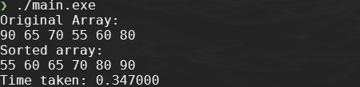

## Algorithms 

- Quick sort Example, \\( O(n\ log\ n)\\)

- Bubble sort Example, \\( O(n^2)\\)

- Selection Sort Example, \\( O(n^2)\\)

- Insertion Sort Example, \\(O(n^2) \\)


~~~admonish info
- All timings are based on an 11th Gen Intel Core i5-11500 @ 2.70GHz 6 Cores.

- The C library function `clock_t clock(void)` returns the number of `clock ticks` elapsed since the program was launched. To get the number of seconds used by the CPU, you will need to divide by `CLOCKS_PER_SEC`, which will be implemented in `main()`.

~~~

In this lab we are going to explore various sorting algorithms sorting a small dataset that is meant to describe heights of various people: 

~~~admonish code

```c
int array1[] = {90, 65, 70, 55, 60, 80};
```

~~~

## Quick Sort Algorithm \\(O(n\ log\ n)\\): 

1. Create a new C++ Console Application call it `SortingAlgorithms`. Remember to modify the `SortingAlgorithms.cpp` so that it is a c file `SortingAlgorithms.c`

2. Creat a header and C file called `Sort.h` and `Sort.c`. 

    - The algorithm works by first: 

      - **Divide and Conquer**: Quicksort is a fast, efficient sorting algorithm, that uses a divide-and-conquer strategy to sort an array.

      - **Picking a Pivot:** It starts by selecting a 'pivot' element from the array, usually the middle element

      - **Partitioning:** The array is then partitioned into two parts – elements less than the pivot are moved before it, and elements greater than the pivot are moved after it.

      - **Recursive Sorting:** This partitioning creates a "partial order". The algorithm then recursively applies the same process to the sub-arrays formed by the partition.

3. Reproduce the following code in `Sort.h`:

    ~~~admonish code

    ```c
    #pragma once
    #ifndef SORT_H
    #define SORT_H

    #include <stdio.h>
    #include <stdlib.h>
    #include <time.h> // For measuring the time complexity of the algorithms, utilised in the main()

    void quicksortMiddle(int arr[], int low, int high);

    void printArray(int arr[], int size);
    #endif // SORT_H
    ```

    ~~~

4. Reproduce the following code in `Sort.c`:

    ~~~admonish code

    ```c
    #include "Sort.h"

    void quicksortMiddle(int arr[], int low, int high) {
        if (low < high) {
            int pivot = arr[(low + high) / 2]; // Selecting the middle element as the pivot
            int i = low; // lower bounds of array
            int j = high; // upper bounds of array
            int temp; // for swapping elements around

            // while low is less than hight (number of elements)
            while (i <= j) {
                while (arr[i] < pivot) i++; // Moving elements smaller than pivot to the left
                while (arr[j] > pivot) j--; // Moving elements greater than pivot to the right

                if (i <= j) {
                    temp = arr[i];         // Swapping elements
                    arr[i] = arr[j];
                    arr[j] = temp;
                    i++; // move up the array 0 to n 
                    j--; // move down the array n to 0
                }
            }

            // Recursively sort the two partitions
            if (low < j) quicksortMiddle(arr, low, j);
            if (i < high) quicksortMiddle(arr, i, high);
        }
    }

    // Utility function to print array
    void printArray(int arr[], int size)
    {
        for (int i = 0; i < size; i++)
        {
            printf("%d ", arr[i]);
        }
        printf("\n");
    }
    ```

    ~~~

5. Now you have the first sorting algorithm is set up we need get the `SortingAlgorithms.c` file ready to invoke the sorting function and calcualte the how long it took. Modify the code, `SortingAlgorithms.c`, to include the following, pay close attention to the comments as they provide verbose guidance:

    ~~~admonish code

    ```c
    #include "Sort.h"

    int main()
    {

        int array1[] = {90, 65, 70, 55, 60, 80}; // partially sorted array of heights
        
        int n = sizeof(array1) / sizeof(array1[0]); // get the middle of the array

        printf("Original Array: \n");
        printArray(array1, n);

        clock_t start, end; // Set up variables to time the algorithm
        start = clock(); // start the timer
        
        // We are iterating over a large number , 10 million times, as this will take nano seconds, and without a lot more code time.h does not go below a micro seconds.  We are going turn millseconds and then convert to nano seconds.  
        for (int i = 0; i < 10000000; i++) {
            // Using the Middle Element as Pivot    
            quicksortMiddle(array1, 0, n - 1);
        }

        end = clock(); // end the timer
        
        // calculate the time taken -  CLOCKS_PER_SEC is time.h macro 
        double cpu_time_used = ((double)((double)end - (double)start)) / CLOCKS_PER_SEC; 

        printf("Sorted with Middle Element as Pivot:\n");
        printArray(array1, n);
        printf("Time taken: %lf", cpu_time_used); 

        return 0;
    }
    ```

    ~~~

6. If you have reproduce the above you should see the following output when you run the program:

    
    
    - You should see that the original array is sorted and the the time taken.
     - Time taken currentlty shows as milliseconds, however this 10^6 times larger than actual time. Remember we repeat the algorithm \\(10\cdot10^6\\) times, so we need to divide by the same to get the actual time. 
Timing:  \\[33.5ns \equiv 33.5 \cdot 10^{-8} =  \frac{335 \cdot 10^{-3}}{10 \cdot 10^6}  \leftarrow \frac{0.335000}{10000000}\\]

7. The graphic below illustrates how the sorting was performed: 

    

---------------------------- 

## Bubble Sort Algorithm \\(O(n\ log\ n)\\): 

The Bubble sort works by repeatedly stepping through the list to be sorted, comparing each pair of adjacent items and swapping them if they are in the wrong order. This process is repeated until no more swaps are needed, indicating that the list is sorted.

- Here's how bubble sort works:

  - Start at the beginning of the array.
   
  - Compare the first two elements. If the first element is greater than the second element, swap them.

  - Move to the next pair of elements and repeat step 2.

  - Continue this process until the end of the array is reached.

  - If any swaps were made during the previous pass through the array, repeat steps 1-4. Otherwise, the array is sorted.

  - Bubble sort works by "bubbling" the largest elements to the end of the array in each pass, hence its name.

1. To implement the bubble sort algorithm, revist the `Sort.h` and add the prototype `void bubblesort(int arr[], int n)`

2. Next open the `Sort.c` file and add the `bubblesort()` functionality, place the following between the two functions, `quicksortMiddle()`, `printArray()`:

    ~~~admonish code

    ```c
    void quicksortMiddle(int arr[], int low, int high) { 
        ...
    }

    void bubbleSort(int arr[], int n) {
        // Outer loop to traverse the array from the beginning to the second-to-last element
        for (int i = 0; i < n - 1; ++i) {
            // Inner loop to compare adjacent elements and perform swaps
            // The loop runs from the beginning to (n - i - 1) to avoid unnecessary comparisons
            for (int j = 0; j < n - i - 1; ++j) {
                // If the current element is greater than the next element, swap them
                if (arr[j] > arr[j + 1]) {
                    // Swap arr[j] and arr[j+1]
                    int temp = arr[j];
                    arr[j] = arr[j + 1];
                    arr[j + 1] = temp;
                }
            }
        }
    }

    void printArray(int arr[], int size) ...
    ```

    ~~~

3. Like before we need to invoke the `bubblesort()` in the `main()`, you'll pleased to note we are adding one line, and commenting another, go back to `SortingAlgorithms.c`:

    ~~~admonish code

    ```c
    int main()
    {
      ...

        for (int i = 0; i < 10000000; i++) {
        // Using the Middle Element as Pivot    
        // quicksortMiddle(array1, 0, n - 1);

           bubbleSort(array1, n);
    
        }
      ...
    }
    ```

    ~~~

4. If you have reproduce the above you should see the following output when you run the program:

    
    
    - You should see that the original array is sorted and the the time taken.
    
    - Time taken currentlty shows as milliseconds, however this 10^6 times larger than actual time. Remember we repeat the algorithm \\(10\cdot10^6\\) times, so we need to divide by the same to get the actual time. 
  
    - Timing:  \\[33.2ns \equiv 33.2 \cdot 10^{-8} =  \frac{332 \cdot 10^{-3}}{10 \cdot 10^6}  \leftarrow \frac{0.332000}{10000000}\\]

5. The graphic below illustrates how the sorting was performed: 

    

---------------------------------

## Selection Sort

Selection sort works by repeatedly finding the minimum element from the unsorted part of the array and moving it to the beginning.

- How it works:

  - Start with the entire array considered as unsorted.
  
  - Find the minimum element in the unsorted portion of the array.
  
  - Swap the minimum element with the first element of the unsorted portion.
  
  - Move the boundary of the unsorted portion one element to the right.
  
  - Repeat steps 2-4 until the entire array is sorted.
  
  - Selection sort is called "selection" because it repeatedly selects the smallest (or largest, depending on the sorting order) element and moves it to its correct position.

1. To implement the bubble sort algorithm, revist the `Sort.h` and add the prototype `void selectionsort(int arr[], int n)`

2. Next open the `Sort.c` file and add the `selectionsort()` functionality, place the following between the two functions, `bubblesort()`, `printArray()`:

    ~~~admonish code

    ```c
    ...
    void bubblesort(nt arr[], int n){
        ...
    }

    // Function to perform selection sort on an array
    void selectionSort(int arr[], int n) {
        // Outer loop to traverse the array from the beginning to the second-to-last element
        for (int i = 0; i < n - 1; ++i) {
            // Assume the current index is the index of the minimum element
            int min_idx = i;
            // Inner loop to find the index of the minimum element in the unsorted portion of the array
            for (int j = i + 1; j < n; ++j) {
                // If the current element is less than the element at the assumed minimum index,
                // update the minimum index to the current index
                if (arr[j] < arr[min_idx]) {
                    min_idx = j;
                }
            }
            // Swap the element at the current index with the element at the minimum index
            int temp = arr[i];
            arr[i] = arr[min_idx];
            arr[min_idx] = temp;
        }
    }

    void printArray(int arr[], int size) ...
    ```

    ~~~

3. Like before we need to invoke the `selectionSort()` in the `main()`, you'll pleased to note we are adding one line, and commenting another, go back to `SortingAlgorithms.c`:

    ~~~admonish code

    ```c
    int main()
    {
      ...

        for (int i = 0; i < 10000000; i++) {
        // Using the Middle Element as Pivot    
        // quicksortMiddle(array1, 0, n - 1);

        // bubbleSort(array1, n);

           selectionSort(array1, n);

        }
      ...
    }
    ```

    ~~~

4. If you have reproduce the above you should see the following output when you run the program:

    
    
    - You should see that the original array is sorted and the the time taken.
    
    - Time taken currentlty shows as milliseconds, however this 10^6 times larger than actual time. Remember we repeat the algorithm \\(10\cdot10^6\\) times, so we need to divide by the same to get the actual time. 
  
    - Timing:  \\[46.4ns \equiv 46.4 \cdot 10^{-8} =  \frac{464 \cdot 10^{-3}}{10 \cdot 10^6}  \leftarrow \frac{0.464000}{10000000}\\]

5. The graphic below illustrates how the sorting was performed: 

    

------------------

## Insertion Sort

Insertion sort works by building a sorted array one element at a time by repeatedly taking the next element from the unsorted part of the array and inserting it into its correct position in the sorted part. 

- How it works:
  - Start with the second element of the array (assuming the first element is already sorted).
  
  - Compare the current element with the elements before it in the sorted portion of the array.
  
  - Shift elements in the sorted portion to the right to make room for the current element, if necessary.
  
  - Insert the current element into its correct position in the sorted portion.
  
  - Move to the next element in the unsorted portion and repeat steps 2-4.
  
  - Repeat this process until the entire array is sorted.
  
- Insertion sort is like sorting a hand of cards: you pick up one card at a time and insert it into its correct position among the cards you're already holding.

1. To implement the bubble sort algorithm, revist the Sort.h and add the prototype `void insertionsort(int arr[], int n)`.

2. Next open the `Sort.c` file and add the `insertionsort()` functionality, place the following between the two functions, `selectionSort()`, `printArray()`:

    ~~~admonish code

    ```c
    ...
    void selectionSort(int arr[], int n) {
    ...
    }
    // Function to perform insertion sort on an array
    void insertionSort(int arr[], int n) {
        // Iterate through the array starting from the second element
        for (int i = 1; i < n; ++i) {
            // Store the current element in a variable key
            int key = arr[i];
            // Initialize a variable j to track the index of the previous element
            int j = i - 1;
            // Move elements of arr[0..i-1], that are greater than key,
            // to one position ahead of their current position
            while (j >= 0 && arr[j] > key) {
                arr[j + 1] = arr[j]; // Move the element to the next position
                j = j - 1; // Move to the previous element
            }
            // Insert the key into its correct position in the sorted part of the array
            arr[j + 1] = key;
        }
    }

    void printArray(int arr[], int size) ...
    ```

    ~~~

3. Like before we need to invoke the `insertionsort()` in the `main()`, you'll pleased to note we are adding one line, and commenting another, go back to `SortingAlgorithms.c`:

    ~~~admonish code

    ```c
    int main()
    {
      ...

        for (int i = 0; i < 10000000; i++) {
        // Using the Middle Element as Pivot    
        // quicksortMiddle(array1, 0, n - 1);

        // bubbleSort(array1, n);

        // selectionSort(array1, n);

           insertionSort(array1, n); 
        }
      ...
    }
    ```

    ~~~
    
4. If you have reproduce the above you should see the following output:

    
    
    - You should see that the original array is sorted and the the time taken.
    
    - Time taken currentlty shows as milliseconds, however this 10^6 times larger than actual time. Remember we repeat the algorithm \\(10\cdot10^6\\) times, so we need to divide by the same to get the actual time. 
  
    - Timing:  \\[15.1ns \equiv 15.1 \cdot 10^{-8} =  \frac{151 \cdot 10^{-3}}{10 \cdot 10^6}  \leftarrow \frac{0.151000}{10000000}\\]

5. The graphic below illustrates how the sorting was performed: 

    

----------------

## Outcome: 

So we can see that the following sorting algorithms can be ranked by time complexity: 

1. Insertion Sort @ 15.1ns
2. Bubble Sort @ 33.2ns
3. Quick Sort @ 33.5ns 
4. Selection Sort @ 46.4ns

-  Download code here -> [SortingAlgorithms.zip](SortingAlgorithms.zip)

--------------------

## Investigation and exploration

1. Try running each algorithm to see if you get different results, record them and work out the average time, either in code or outside. 

2. Run each algorithm again using the following two arrays, and again compare the times:

    - Sorted
       - `int array1[] = {55, 60, 65, 70, 80, 90};`
    
    - Revesed Sorted
       - `int array1[] = {90, 80, 70, 65, 60, 55};`

3. Increase the size of the array and see if the current performance changes accross the each algorithm and rank them. 