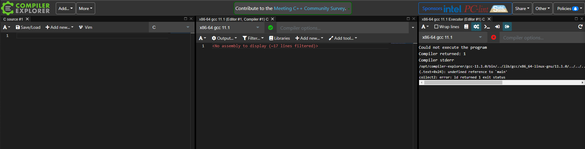
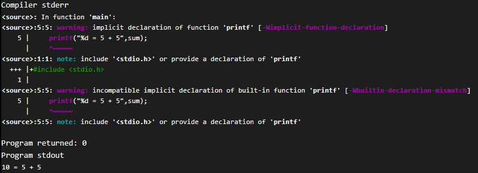

# Compilers

# Introduction

The **Compilers** lab is designed for to experience different programming languages, how they compile and subsequent inputs and outputs. You will develop basic understanding and appreciation of how high level code compiles down to machine code.

We will be using <https://gcc.godbolt.org> which is an interactive compiler exploration website that supports multiple language codes with the functionality to see in real time the compiled code.

~~~admonish info

Throughout this lab you will can refer to documentation for the source code and the compiled code:

- **C** -> [https://devdocs.io/c/](https://devdocs.io/c/)

- **GCC** -> [https://www.gnu.org/software/gnu-c-manual/gnu-c-manual.html#Preface](https://www.gnu.org/software/gnu-c-manual/gnu-c-manual.html#Preface)

- **Python** -> [https://blog.finxter.com/python-cheat-sheet/](https://blog.finxter.com/python-cheat-sheet/)

- **Python 3.9 Bytebase** -> [https://docs.python.org/3/library/dis.html#python_bytecode_instructions](https://docs.python.org/3/library/dis.html#python_base_bytecode_instructions)

- **Ada** -> [https://docs.adacore.com/live/wave/arm12/html/arm12/arm12.html](https://docs.adacore.com/live/wave/arm12/html/arm12/arm12.html)

- **GNAT** -> [https://gcc.gnu.org/onlinedocs/gcc-4.7.4/gnat_ugn_unw.pdf](https://gcc.gnu.org/onlinedocs/gcc-4.7.4/gnat_ugn_unw.pdf)

~~~

## Basics of C

Throughout this lab you will can refer to documentation for the soruce code and the compiled code.

Go to [https://gcc.godbolt.org/z/6hTG88doT](https://gcc.godbolt.org/z/6hTG88doT) to access a blank script in C.


Once you have loaded this you should see three windows like shown below.

The first window is where you select your language code type in your source code, the second window shows you the complied source code, to the compiler of your choice, and the third window shows output to console/terminal.



C is one the of foundational code languages upon which many other languages draw lineage from. C like C# uses the same keywords and you will see common syntax. For those who have not experienced C# do not worry, we are going to go step by step.

In order for any program to run C must have a `main()` function, for this is the entry point for script. All code gets executed in the main, you can create other functions outside of `main()` and call them inside.

Now you will need to write in the following code as seen below into the first window of **Compiler Explorer** that says C Source.

~~~admonish code

```c
int main()
{
    return 0;
}
```

~~~

~~~admonish example title='A quick break down of what we are seeing here:'

- Line 1 has the functions name and a returnable keyword, `int`. This means that when `main()` executes and reaches the end of the script it will return an integer to indicate it has finished to the hosts environment.
- Line 3 introduces the keyword `return` which will return a value, in this ase 0, an `int`
- Lines 2 an 4 have the identifiers `{ }`, this encapsulates the code into a block. The compiler needs this syntax to understand where a block of code starts and finishes.

~~~

As you were entering the source code into the window 1, you will have seen the second window compiling the code in real-time. Your assembly
code should look like below.

~~~admonish code

```nasm
main:
  pushq %rbp
  movq %rsp, %rbp
  movl $0, %eax
  popq %rbp
  ret
```

~~~


The code looks very similar to that of the lecture, keywords/instructions; `pushq`, `movq`, `movl`, `popq` and `ret`. So nothing should be new here, even the commands to left of the keywords are the same. 

~~~admonish info

However, the ending letter `l` and `q` denotes a 32-bit or 64-bit number respectively.

~~~

Not lets see when we add two integers together.

Edit the source code the look like the following:

~~~admonish code


```c
int main()
{
    int a = 5;
    int b = 5;
    int sum = a + b;
    return 0;
}
```

~~~

~~~admonish example title='Explanation'

- We declare the data we want our variables to be in this instance `int` on lines 3 to 5. 
- Remember, C is strong typed. 
- We provide the keyword with an identifier, `a`, `b`, and `sum` and those identifiers
with the values `5` & `5` and the result of `5 + 5`.

~~~

Now we can see that the compiled code has changed and should look like below:

~~~admonish code

```nasm
main:
  pushq %rbp
  movq %rsp, %rbp
  movl $5, -4(%rbp)
  movl $5, -8(%rbp)
  movl -4(%rbp), %edx
  movl -8(%rbp), %eax
  addl %edx, %eax
  movl %eax, -12(%rbp)
  movl $0, %eax
  popq %rbp
  ret
```

~~~

~~~admonish example title='Explanation'

Now we have an extra 6 lines of code to examine, specifically lines 4 to 10.

- Firstly, looking at lines 4 and 5, we can see that the value 5 is stored in memory addresses that are 4 and 8 bytes away from the `%rbp`, recall from the lecture about memory spacing.

  ```nasm
    movl $5, -4(%rbp)
    movl $5, -8(%rbp)
  ```

- Next we can see that lines 6 and 7 reference the addresses of the two values by accessing the addresses located 4 and 8 bytes away from the `%rdp` and get ready to perform artimetic operations by storing using `%edx` and `%eax`.

  ```nasm
    movl -4(%rbp), %edx
    movl -8(%rbp), %eax
  ```

- Ok so finally we can see that lines 8, 9 and 10 deal with summation of the variables `a` and `b`.

  ```nasm
    addl %edx, %eax
    movl %eax, -12(%rbp)
    movl $0, %eax
  ```

- Notice we have a new keyword, `addl`, we are now adding the two values stored in the addresses pointed to by `%edx` and `%eax`.

- The code then tempoarily stores the result in `%eax` and moves it memory address 12 bytes away from the `%rdp`. Finally, `%eax` is zeroed off so it does not point to anything.

~~~

**CALL TO ACTION**

So you add different ways and this can change the output of the compiler. Modify the code so that it looks like the various examples shown below and note the differences in the compiled code:

~~~admonish code


```c
int main()
{
    int a = 5;
    int sum = a + 5;
    return 0;
}
```

```c
int main()
{
    int sum = 5 + 5;
    return 0;
}
```

~~~


Lets do something that includes window 3, the console/terminal. As long as you code has been compiling fine the output displayed should be...

~~~admonish output

```
Program returned: 0
```

~~~

So what about if we want to return the result of the summation we have been doing to the console/terminal? Make your source code look like the below.

~~~admonish code

```c
#include <stdio.h>
int main()
{
    int sum = 5 + 5;
    printf("%d = 5 + 5", sum);
    return 0;
}
```

~~~

Ok so lets look at the first line, this is new, in order to output information generated by the programmer to the terminal, C needs to `"include"` a library of functions/code/operations. So we will include 'Standard Input Output' library.

~~~admonish code

```c
#include <stdio.h>
```

~~~

The file extension for this library is `.h`, in C and C++ libraries and imported code are stored in header files, hence the `.h`.

If you don't include this library with the source code you will see the error, like below, in window three and if you read the message you are told to include the missing library.

~~~admonish warning



~~~

Lets look at line 6, we can see we are using a new function that comes from the `stdio.h` library, `printf()`.

~~~admonish code

```c
printf("%d = 5 + 5",sum);
```

~~~

~~~admonish example title='Explanation'

So breaking this down we can see that `printf()` function currently has two arguments or inputs.

Firstly, we have a `string`, this is a data type that lets you store a sequence of characters.

The second argument is the identifier `sum`, remember this is the result of the summation the script performs.

Finally, we have a format specifier in the string `%d` this means at this position in the string you are promising to provide an variable, in this case an integer(d), `sum`.

You can see more about format specifiers here,
[https://www.tutorialspoint.com/format-specifiers-in-c](https://www.tutorialspoint.com/format-specifiers-in-c).

~~~

Now if we look in the compiler window we can see more code as expected, and certainly some new things.

~~~admonish code

```nasm
.LC0:
  .string "%d = 5 + 5"
main:
  pushq %rbp
  movq %rsp, %rbp
  subq $16, %rsp
  movl $10, -4(%rbp)
  movl -4(%rbp), %eax
  movl %eax, %esi
  movl $.LC0, %edi
  movl $0, %eax
  call printf
  movl $0, %eax
  leave
  ret
```

~~~


~~~admonish example title='Explanation'

- Looking over this code, we can see 5 new lines. 
- The first line `.LC0:` means local constant, e.g string literal, constants are values that cannot be changed.
- Line 2, shows `string` which means here is a string from `printf()`...

  ```nasm
  .LC0:
    .string "%d = 5 + 5"
  ```

- The next new line is 6, reserves 16 bytes of memory for local variables, we have a string now.

  ```nasm
    subq $16, %rsp
  ```

- The fourth new line,9, points the address of the result of the sum to `%esi`. `%esi` links to the `printf()` function where it passes the value of this address into `%d` format specifier.

  ```nasm
  movl %eax, %esi
  ```

- The fifth new line is line 10, where the local constant `.LC0` address is pointed to bb `%edi`.

  ```nasm
    movl $.LC0, %edi
  ```

- Finally, line 12 use a keyword call to the function printf, that is linked to `call printf`

  ```nasm
    call printf
  ```

~~~

--- 
**CALL TO ACTION**

Modify the code to increment the sum by itself and print to console:

```c
#include <stdio.h>
int main()
{
    int sum = 5 + 5;
    printf("%d = 5 + 5\n",sum);
    int sumsum = sum+sum;
    printf("%d = %d + %d\n",sumsum,sum,sum);
    return 0;
}
```

~~~admonish tip

Did you know that if you hover over the lines in the source code related compiler code is highlighted.

~~~

~~~admonish question

What differences can you see, in the compiled code?

~~~

---

## Python

Now you have a look two basic operations in C and analysed the compile code, lets look at Python which you may find easier to understand.

Unlike C and other languages, Python doesn't need you to define data types, ints, floats, chars, string etc. and therefore is consider loose
typed.

Select Python from the drop down list in the window 1, top right. Or go here...[https://godbolt.org/z/7dbb69Gxh](https://godbolt.org/z/7dbb69Gxh)


You will probably notice several major differences, and maybe the compiler looks easier to understand?

So we make an easier comparison between C and Python source code and compilers, lets use the same code as before, modify your to look like the below.

Line 1 the keyword,`def`, defines a function whose name is, `main()`. Line 2 `pass`
is essientally a placeholder.

~~~admonish code

```python
def main():
    pass
```

~~~

**CALL TO ACTION**

Python is particular about formatting, if code belong inside a function, or block then it must be indented by 4 spaces or tab.

If you look at the IDE there are four faint when you highlight the white space between pass and the left of the word.

So lets look at the compiled code for this function.

~~~admonish code

```nasm
LOAD_CONST      1 (|'|main|')|
MAKE_FUNCTION   0
STORE_NAME      0 (main)
LOAD_CONST      2 (None)
RETURN_VALUE
```

~~~


So we can see that we have completely different assembly code..., well that isn't a bad thing. Each code language compiles differently. Sometimes these assembly languages are easier to understand as they are written using meaningful words.

~~~admonish example title='Explanation'

- Line 1, loads the script as a constant, remember constant is something that isn't allowed to change.

- Line 2, takes the name of the first function and loads it in to memory too.

- Then the function is made at line 3, `MAKE_FUNCTION`.

- `STORE_NAME` on line 4, creates a name for the function main so that it the function can be reference later.

- Remember `pass`, was a placeholder, well line 6 shows the nothing is to be loaded.

- This is much easier to understand right?

~~~

Now lets modify the source code again.

~~~admonish code

```python
def main():
    a = 5
    b = 5
    c = 5 + 5   
```

~~~

So simple enough, three variables that contain whole numbers. This is the same as our C example earlier, though we are not using the identifier sum as we did in C, because in Python `sum` is a keyword.

We will now look at the compiled code, but only from line 9, as the previous lines are the same as before.

~~~admonish code

```nasm
LOAD_CONST      1 (5)
STORE_FAST      0 (a)

LOAD_CONST      1 (5)
STORE_FAST      1 (b)

LOAD_CONST      2 (10)
STORE_FAST      2 (c)
LOAD_CONST      0 (None)
RETURN_VALUE
```

~~~

~~~admonish example title='Explanation'

- Lines 9, 12 and 15 show that the values of the variables are loaded into memory.

- Lines 10, 13 and 16 stores the variable name into the top of the stack (memory).

- Much like C's `movl $0, %eax` python's compiler resets the memory pointer.

~~~

Okay, so we are almost there, but we haven't sent anything to the terminal yet, modify your code to look like this.

~~~admonish code

```python
def main():
    a = 5
    b = 5
    c = 5 + 5
    print(c," = ", a, " + ",b)
main()
```

~~~


So only two new lines, 5 and 6.

~~~admonish example title='Explanation'

- On line 5 the `printf()` function takes each variable (a,b,c) separated by string to produce 10 = 5 + 5.

- Line 7, is where we call the function `main` which will cause all of the code to be executed the output appear in the console/terminal (window 3).

- Now lets look at the additional code that has appeared in the compile window.

- Line 6 to 10 shows how the the function `main` is called in line 7 of the source code.

~~~

~~~admonish code

``` nasm
LOAD_NAME             0 (main)
CALL_FUNCTION         0
POP_TOP
LOAD_CONST            2 (None)
RETURN_VALUE
```

~~~

~~~admonish example title='Explanation'

- You can see that the function is loaded by its name, `LOAD_NAME`, which was originally stored in memory with `STORE_NAME` earlier.

- The function is then called `CALL_FUNCTION` and subsequently removed `STORE_NAME` from the top of the stack (memory).

~~~

## Ada

Ada is used in a lot of less "popular" use cases where there is a strong focus on security (Ada is extremely strong typed, all data types used must be defined, no intrinsic types) and concurrency (using Ada's task features). The US Department of Defense, which developed Ada, still needs that level of quality for the Space Station and for weapons systems where proper function was a matter of life or death.

You are not likely to use Ada in industry, unless you are working for a space agency or defense, but we should probably look at this language because it is named after Ada Lovelace, who was the first human to write a computer program for the Analytical Engine - a machine that we now call...the computer.

---

~~~admonish information

- Documentation for Ada 2012 is available at:
  - [https://docs.adacore.com/live/wave/arm05/html/arm05/arm05.html](https://docs.adacore.com/live/wave/arm05/html/arm05/arm05.html)

  - Or Ada 1995 (before some of you were born...) can be found below and provides a nicer interface to look at how the code works, though this version may not have all 2012 edition functions it will provide as good ndation:

  - [https://www.radford.edu/$\sim$nokie/classes/320/stdlibhtml/](https://www.radford.edu/~nokie/classes/320/std_lib_html/)

~~~

---

**CALL TO ACTION**

1. Select Ada from the drop down list in the window 1, top right or go here:
   - [https://godbolt.org/z/nrvs9GTvE](https://godbolt.org/z/nrvs9GTvE)

2. Modify the Ada script to look like this...

~~~admonish code

```ada
pragma Source_File_Name (main, Body_File_Name => "main.adb");

procedure main is

a : Integer := 5;
b : Integer := 5;
c : Integer;
begin

c := a + b;
 
end main;
```

~~~

~~~admonish example title='Explanation'

- Line 1, holds no significance to the compiled code and used to override the normal naming convention of a this script.

- Line 3 and 12 wrap the code inside of `main()` this is so the code we write can actually execute.

- Now lets look the following lines of code.

  ```ada
  a : Integer := 5;
  b : Integer := 5;
  c : Integer;
  ```

- As stated earlier Ada code language is strongly typed, and as such you have to define the data types for each variable. Unlike C/C++/C#/Java etc. the identifier `a`, `b` and `c` comes before the data type keyword `Integer` which is the preceded by the assigned value, `5`, that is compatible with that data type.

- So lets look at the assembly code. Well this should look familiar to you now... if not revisit the earlier section on C.

  ```nasm
  _ada_main:
    pushq %rbp #
    movq %rsp, %rbp #,
    movl $5, -4(%rbp) #, a
    movl $5, -8(%rbp) #, b
    movl $10, -12(%rbp) #, c
    nop 
    popq %rbp #
    ret 
  ```

- The eagle eyed among you will have noticed there is one new command which is on Line 7.

  ```nasm
  nop 
  ```

- `nop` is the command for no operation. This is not necessarily a time-consuming process, the processor might remove it from the pipeline before it reaches the execution stage.

~~~

All that remains here is to print information to the console, so modify your code to look like this.

~~~admonish code

```ada
pragma Source_File_Name (main, Body_File_Name => "main.adb");
with Ada.Integer_Text_IO;use Ada.Integer_Text_IO;

procedure main is

a : Integer := 5;
b : Integer := 5;
c : Integer;
begin

c := a + b;
Put(c);
end main;
```

~~~

~~~admonish example title='Explanation'

- So you'll notice that that the only differences are line 2 and line 12.

- Line 2, imports some libraries needed to send data to the output,

  ```ada 
  with Ada.Integer_Text_IO;use Ada.Integer_Text_IO;
  ```

- Line 12, use the `Put` functions to 'put', an integer in this case, to the terminal. Without line 2, we could not output the integer to the console/terminal.

  ```ada
  Put(c);
  ```

- Ok so now we can look at the assembly code, and much like the compiled C code, we can see familiar commands, keywords and operations. However once again, you may have noticed three new lines?

  ```nasm
  _ada_main:
    pushq %rbp #
    movq %rsp, %rbp #,
    subq $16, %rsp #,
    movl $5, -4(%rbp) #, a
    movl $5, -8(%rbp) #, b
    movl $10, -12(%rbp) #, c
    movl ada__integer_text_io__default_base(%rip), %edx #
    movl ada__integer_text_io__default_width(%rip), %eax #
    movl %eax, %esi #
    movl $10, %edi #
    call ada__integer_text_io__put__2  # 
    nop #
    leave # 
    ret #
  ```


- There are two new functions `Ada__integer_text_io__default_base` and `ada__integer_text_io__default_width`.

  ```nasm
  movl ada__integer_text_io__default_base(%rip), %edx #
  movl ada__integer_text_io__default_width(%rip), %eax #
  ```

- The latter gets the length of the number in bits, so in our case 32-bits or 4 bytes as integers are 4 bytes and former selects the base number, as this an integer we are base 10. There is also a new assembly reference `%rip`, or register instruction pointer which points to the `%edx` and `%edi` memory locations.

- Now we can look at the next new line, 12.

  ```nasm
  call ada__integer_text_io__put__2  # 
  ```

- This function sends the data pointed to by `%rip` to the console/terminal.

~~~

---

**CALL TO ACTION**

Modify the code to print all variables to the output and see how the assembled code changes and compare the console outputs. If you have an error did you get every new line of code?

~~~admonish code

```ada
pragma Source_File_Name (Square, Body_File_Name => "main.adb");
with Ada.Text_IO; use Ada.Text_IO;
with Ada.Integer_Text_IO; use Ada.Integer_Text_IO;

procedure main is

a : Integer := 5;
b : Integer := 5;
c : Integer;

begin

c := a + b; 

Put(c);
Put(" =");
Put(a);
Put(" +");
Put(b);

end main;
```

~~~

~~~admonish code

```ada
pragma Source_File_Name (Square, Body_File_Name => "main.adb");
with Ada.Text_IO; use Ada.Text_IO;
with Ada.Integer_Text_IO; use Ada.Integer_Text_IO;

procedure main is

a : Integer := 5;
b : Integer := 5;
c : Integer;

begin

c := a + b; 

Put_Line(Integer'Image(C) & " =" & Integer'Image(a) & " +"& Integer'Image(b));

end main;
```

~~~

---

## C#

If you are feeling brave, why not have a go at replicating the lab using C#

