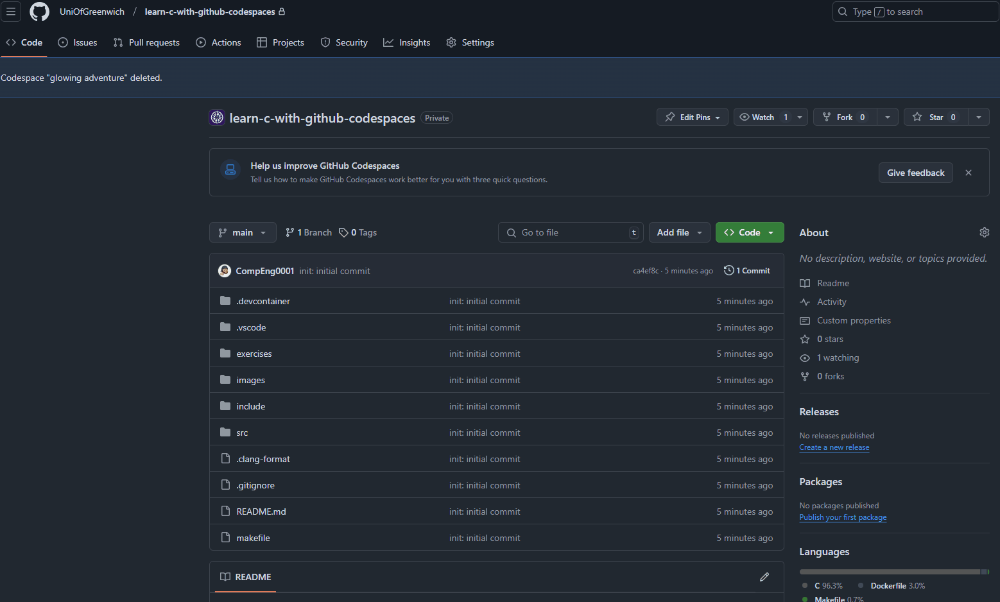

# Debugging

**Computer says no!**, from novices to experiences programmers errors at compile and run time can plague development. This is they way of life of a programmer:

Debugging is a very important tool for a programmer, as it enables them to check every line and instruction by essientially pausing the program at specific point and stepping into, out of, and over each instruction and line code. It is like a window into the execution of the code. 

~~~admonish warning

You need to be part of the [ELEE1147-_2024-25](https://github.com/orgs/UniOfGreenwich/teams/elee1147-_2024-25) team. If you are not you MUST let me know!

~~~

~~~admonish todo

Go to the following github link and `fork` then open a code space and start learning to use the comipler to debug: [https://github.com/UniOfGreenwich/learn-c-with-github-codespaces](https://github.com/UniOfGreenwich/learn-c-with-github-codespaces)

~~~

