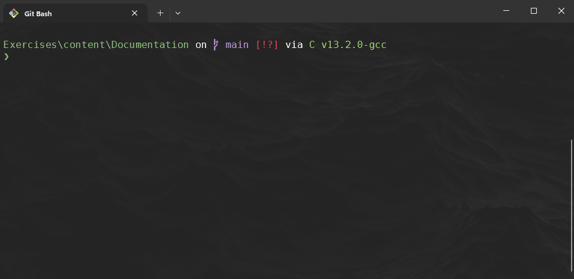
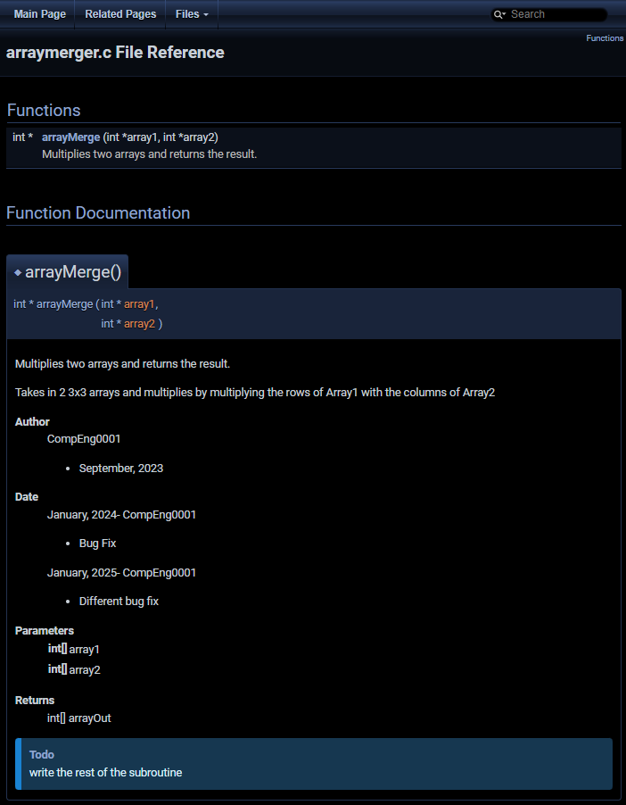
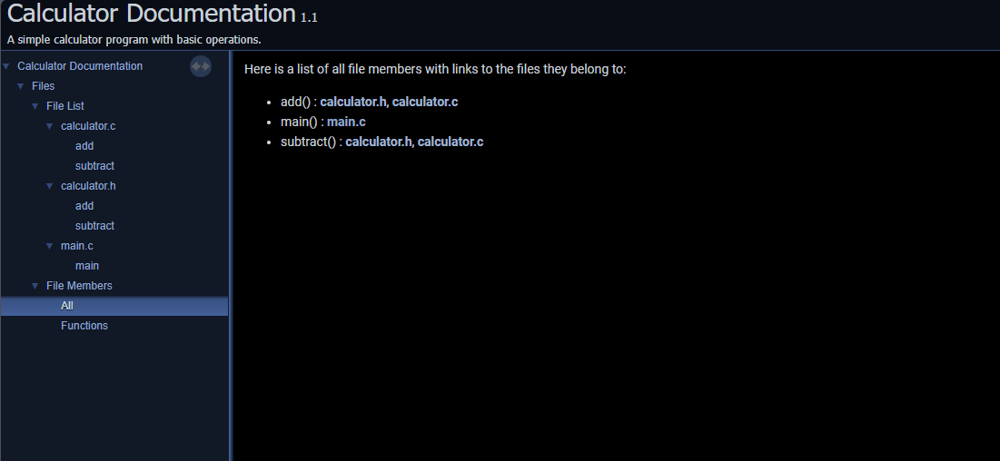

# Documentation

~~~admonish important 

- For university machines do the following: 

    - Download the following file and extract it to the same directory as this lab, or alternatively once extract add to `$PATH`

    - [doxygen-1.13.2-windows.zip](./doxygen-1.13.2-windows.zip)
        -  Sha256sum: `eef4a6f823500e501bfb0c8e95182a5950f93b49d3b02b01e7d16d36780d1a3d`

- For you own machine: 
    - [https://www.doxygen.nl/download.html](https://www.doxygen.nl/download.html)
        - Note hash will be different to above a the one package for university only contains two files. 

~~~


~~~admonish warning

ALWAYS verify downloaded files if supplied with a hash code to ensure they have not been tampered with.



~~~


~~~admonish example title='Doxygen Syntax Example' collapsible=true

```c
/**
 * @brief Merges two arrays and returns the merged array 
 * 
 * @detail Takes in 2 3x3 arrays and multiplies 
 * by multiplying the rows of Array1 with  
 * the columns of Array2 
 * 
 * @author CompEng0001
 * - September, 2023 
 * @date January, 2024- CompEng0001 
 * - Bug Fix 
 * @date January, 2025- CompEng0001
 * - Different bug fix 
 * @param int[] array1
 * @param int[] array2
 * @return int[] arrayOut 
 * @todo write the rest of the subroutine 
 */
int* arrayMerge(int* array1, int* array2);
```

**Output**




If you want to know more then go here: [https://www.doxygen.nl/manual/commands.html#cmddetails](https://www.doxygen.nl/manual/commands.html#cmddetails)

~~~

## Task 1: Doxygen with C 

Here is an example output of what we are going to create: <a href="docs/html/index.html" target="_blank">Output</a> (redirects to new tab)

1. Create a new directory called `Documentation`  and create the following files: 
   - `main.c`
   - `calculator.c`
   - `calculator.h`

2. Modify the `main.c` code:

    ~~~admonish code collapsible=true
   
    ```c
    /**
    * @file main.c
    * @brief Simple calculator program with basic operations.
    */
    #include <stdio.h>
    #include "calculator.h"

    /**
    * @brief Main function to demonstrate calculator operations.
    * @return 0 if successful, otherwise an error code.
    */
    int main(){

        int num1, num2;

        printf("Enter two numbers: ");
        scanf("%d %d", &num1, &num2);

        printf("Sum: %d\n", add(num1, num2));
        printf("Difference: %d\n", subtract(num1, num2));

        return 0;
    }
    ```

    ~~~

3. Modify the `calculator.h` file:

    ~~~admonish code collapsible=true

    ```c
    #ifndef CALCULATOR_H_
    #define CALCULATOR_H_

    /**
    * @brief Adds two numbers.
    * @param a The first operand.
    * @param b The second operand.
    * @return The sum of a and b.
    */
    int add(int a, int b);

    /**
    * @brief Subtracts two numbers.
    * @param a The first operand.
    * @param b The second operand.
    * @return The result of subtracting b from a.
    */
    int subtract(int a, int b);

    #endif

    ```

    ~~~


4. Modify the `calculator.c` file:

    ~~~admonish code collapsible=true

    ```c
    #include "calculator.h"

    int add(int a, int b) {
        return a + b;
    }

    int subtract(int a, int b) {
        return a - b;
    }
    ```

    ~~~

5. You can compile the code like normal, in case you can't remember how:
    
    ~~~admonish terminal collapsible=true
     
     ```
     $ gcc main.c calculator.c -o calculator.exe
     $ ./calculator.exe
     ```
    ~~~

6. To render the doxygen styled comments we need to use the `doxygen.exe` and a configuration file. 

    - Run `./doxygen.exe -h` in the command line to see the helper, read it and workout the argument to generate the configuration file called `Doxyfile`
    
    ~~~admonish terminal collapsible=true title='Answer...'

    ```
    $ ./doxygen.exe -g
    ```
    ~~~

    ~~~admonish tip

    Remember to have extracted the `doxygen.exe` and `libclang.dll` to the same folder as the calculator source code, or update the `$PATH` to include `/path/to/doxygen.exe`
    
    ~~~

7. Now take the time to read the newly created Doxyfile, either use a text editor or display on the terminal using `less`:

    ~~~admonish terminal

    ```
    $ <code/less/nano/vim/vi> Doxyfile
    ```

    ~~~
    
    - Did you notice that there was rather a lot of configuration options, luckily they are well commented!

8. For the purpose of this exercise we are going to use the following configuration:

    ~~~admonish terminal

    Empty the Doxyfile to start a fresh
    ```
    $ echo > Doxyfile
    ```

    ~~~

    ~~~admonish code collapsible=true

    ```
    # Doxyfile for the project

    DOXYFILE_ENCODING      = UTF-8
    PROJECT_NAME           = "Calculator Documentation"
    PROJECT_NUMBER         = 1.0
    PROJECT_BRIEF          = "A simple calculator program with basic operations."

    OUTPUT_DIRECTORY       = ./docs
    CREATE_SUBDIRS         = NO

    # Add all the source files to the INPUT option
    INPUT                  = main.c \
                             calculator.h \
                             calculator.c

    RECURSIVE              = NO

    EXTRACT_ALL            = YES
    EXTRACT_PRIVATE        = YES
    EXTRACT_STATIC         = YES
    EXTRACT_LOCAL_CLASSES  = YES

    GENERATE_LATEX         = NO
    GENERATE_HTML          = YES
    ```
    ~~~

9. You should now see a folder `docs/` in your current working directory, if you navigate you will find an `index.html`, which when opened in a browser will display the following:

    ~~~admonish example collapsible=true title='Doxygen Calculator Project Documentation Render'

    

    ~~~

10. Consider expanding on the Calculator add some more features and explore more features with Doxygen: (https://www.doxygen.nl/examples.html)[https://www.doxygen.nl/examples.html]