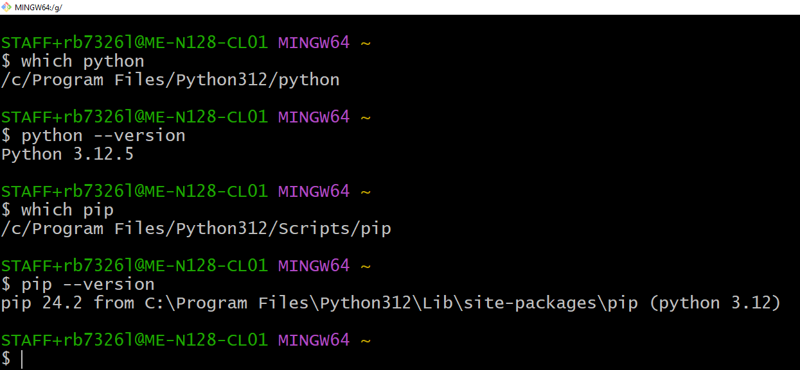
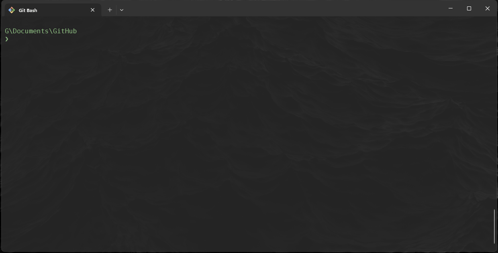
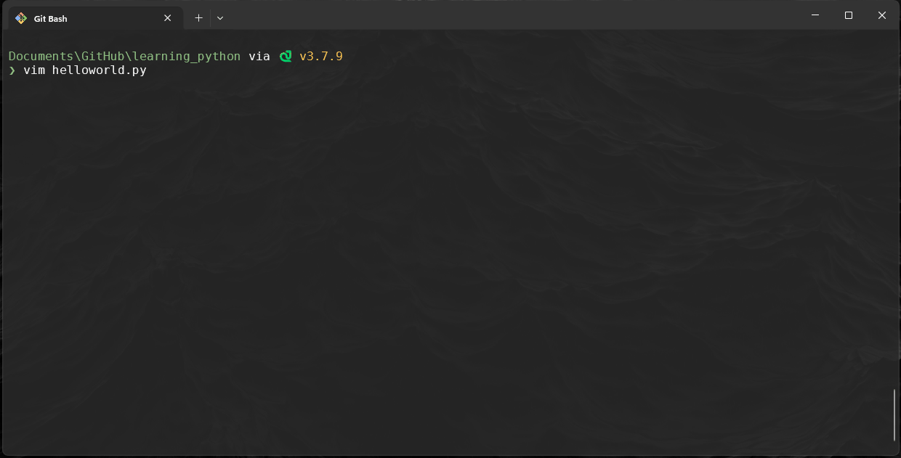

# Learning Python

We will be doing this lab inconjuction with the Python lecture. Key concepts will be explained and you will put into practice.

## 0. Interpreter for Python

- We should not need to do anything for the university machines to run python as this is already part of the PATH, you can run the following commands: 

    ~~~admonish terminal

    ```sh
    $ which python
    $ python --version
    $ which pip
    $ pip --version
    ```

    ~~~

    ~~~admonish output

    

    ~~~

So let's make our first program.

## Exercises 1. Hello World

1. Frist we need to create a directory and file, call directory `learning_python` and create a file in side it called `helloworld.py`:

    

2. Modify the files content to contain the following:
    
    ~~~admonish code

    ```py
    def main():
        print("Hello World!")
        print("Goodbye World!")

    if __name__=="__main__":
        main()
    ```

    ~~~

    

## Exercise 2: Variables and Data Types

**Instructions:**

0. Create a new file called `variables.py`
1. Create a variable called `name` and assign it your name as a string.
2. Create a variable called `age` and assign it your age as an integer.
3. Create a variable called `height` and assign it your height in meters as a float.
4. Print each variable on a new line.
5. and then run it.

    ~~~admonish code

    ```python
    name = "Your name"
    age = 25
    height = 1.75

    print(name)
    print(age)
    print(height)
    ```

    ~~~

    ~~~admonish terminal

    ```bash
    $ python variables.py
    > Your name
    > 25
    > 1.75
    ```

    ~~~

## Exercise 3: Basic Operations

**Instructions:**

0. Create a new file call it `basicMaths.py`
1. Create two variables, `a` and `b`, and assign them any two numbers.
2. Perform and print the results of addition, subtraction, multiplication, and division between `a` and `b`.
3. Use the modulus operator to find the remainder of `a` divided by `b` and print the result.
4. and then run it.

    ~~~admonish code

    ```python
    a = 10
    b = 3

    print("Addition:", a + b)
    print("Subtraction:", a - b)
    print("Multiplication:", a * b)
    print("Division:", a / b)
    print("Modulus:", a % b)
    ```

    ~~~
    
    ~~~admonish terminal

    ```bash
    $ python basicMaths.py
    > Addition: 13
    > Subtraction: 7
    > Multiplication: 30
    > Division: 3.3333333333333335
    > Modulus: 1
    ```

    ~~~

## Exercise 4: Lists and Indexing

**Instructions:**

0. Create a new file called `lists.py`
1. Create a list called `fruits` that contains the following fruits: `"apple"`, `"banana"`, `"cherry"`.
2. Print the first fruit in the list.
3. Add a new fruit `"orange"` to the list and print the updated list.
4. Remove `"banana"` from the list and print the list again.
5. and then run it

    ~~~admonish code

    ```python
    fruits = ["apple", "banana", "cherry"]
    print("First fruit:", fruits[0])

    fruits.append("orange")
    print("Updated list:", fruits)

    fruits.remove("banana")
    print("List after removing banana:", fruits)
    ```

    ~~~
    
    ~~~admonish terminal

    ```bash
    $ python lists.py
    > First fruit: apple
    > Updated list: ['apple', 'banana', 'cherry', 'orange']
    > List after removing banana: ['apple', 'cherry', 'orange']
    ```

    ~~~

## Exercise 5: Conditional Statements

**Instructions:**

0. Create a file called `conditionals.py`
1. Write a program that checks if a number is positive, negative, or zero.
2. Assign a value to the variable `number` and use `if`, `elif`, and `else` to print:
   - `"Positive"` if the number is greater than 0
   - `"Negative"` if the number is less than 0
   - `"Zero"` if the number is exactly 0.
3. and then run it.
4. change 5 to 0 and run again

    ~~~admonish code

    ```python
    number = 5

    if number > 0:
        print("Positive")
    elif number < 0:
        print("Negative")
    else:
        print("Zero")
    ```

    ~~~

    ~~~admonish terminal

    ```bash
    python conditionals.py
    Positive
    python conditionals.py
    Zero
    ```

    ~~~

## Exercise 6: Loops

**Instructions:**

0. Create a file called `loops.py`
1. Write a `for` loop that prints numbers from 1 to 5.
2. Create a list of your favorite colors and use a `for` loop to print each color.
3. Write a `while` loop that prints numbers from 10 down to 1.
4. run the program

    ~~~admonish code

    ```python
    # For loop to print numbers from 1 to 5
    for i in range(1, 6):
        print(i)

    # For loop to print each favorite color
    favorite_colors = ["blue", "green", "red"]
    for color in favorite_colors:
        print(color)

    # While loop to print numbers from 10 down to 1
    n = 10
    while n > 0:
        print(n)
        n -= 1
    ```

    ~~~

    ~~~admonish terminal

    ```bash
    $ python loops.py
    > 1
    > 2
    > 3
    > 4
    > 5
    > blue
    > green
    > red
    > 10
    > 9
    > 8
    > 7
    > 6
    > 5
    > 4
    > 3
    > 2
    > 1
    ```

    ~~~

## Exercise 7: Functions

**Instructions:**

0. Create a new file called `functions.py`
1. Write a function called `greet` that takes a name as a parameter and prints `"Hello, <name>!"`.
2. Write a function `square` that takes a number as a parameter and returns its square.
3. Test both functions by calling them with sample inputs.

    ~~~admonish code

    ```python
    def greet(name):
        print(f"Hello, {name}!")

    def square(number):
        return number ** 2

    # Testing the functions
    greet("Alice")
    print("Square of 4:", square(4))
    ```

    ~~~

    ~~~admonish terminal

    ```bash
    $ python functions.py
    > Hello, Alice!
    > Square of 4: 16
    ```

    ~~~

## Exercise 8: Dictionaries

**Instructions:**

0. Create the a file called `dictionaries.py`
1. Create a dictionary called `student` with keys: `name`, `age`, and `courses`. Assign appropriate values to each.
2. Print the student's name and age.
3. Add a new key `graduation_year` with a sample year and print the updated dictionary.
4. and run it. 

    ~~~admonish code

    ```python
    student = {
        "name": "Your name",
        "age": 21,
        "courses": ["Subject1", "Subject2"]
    }

    print("Name:", student["name"])
    print("Age:", student["age"])

    student["graduation_year"] = 2025
    print("Updated student dictionary:", student)
    ```

    ~~~

    ~~~admonish terminal

    ```bash
    $ python dictionaries.py
    > Name: Your name
    > Age: 21
    > Updated student dictionary: {'name': 'Your name', 'age': 21, 'courses': ['Subject1', 'Subject2'], 'graduation_year': 2025}
    ```
    
    ~~~