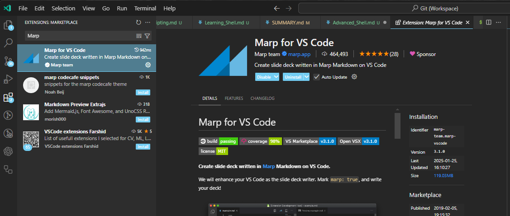
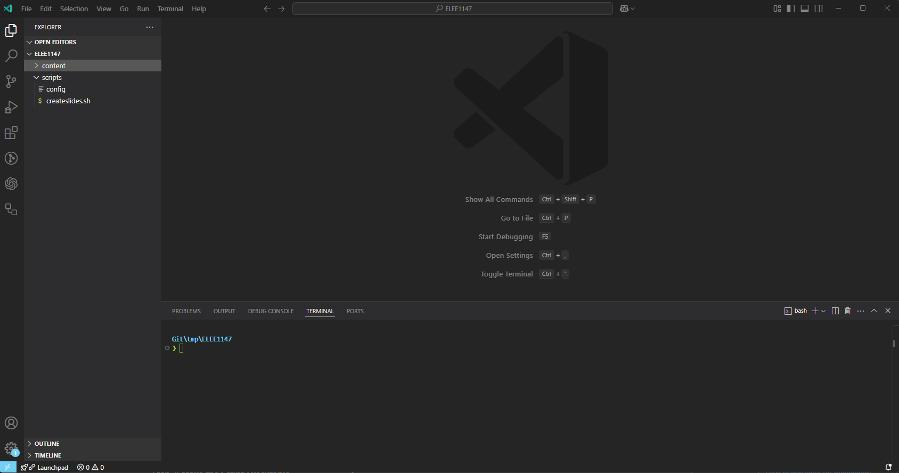

# Advanced Shell

~~~admonish warning

Ensure you have a Bash shell available and working. You should already be comfortable with basic shell scripting concepts, including variables, loops, and conditionals, see [Learning_Shell/Learning_Shell.md](Learning_Shell/Learning_Shell.md)

~~~

## Task 1. Using functions

~~~admonish information

Functions need to be defined before they are invoked, remembering that the language interpreted line by line. 

~~~

1. Create a new script called `functions.sh`:

    ~~~admonish code

    ```sh
    #! /usr/bin/env bash

    # Note the positional parameters are not specified in the function parentheses 
    greet() {
        echo "Hello, $1!"
    }
    
    
    sum() {
        echo "$(( $1 + $2 ))"
    }

    # This parameter is supplied to the script
    greet "$1"
    echo "The sum of $2 and $3 is: $(sum $2 $3)"
    ```

    ~~~

2. Try running the script to see what happens

    ~~~admonish terminal

    ```sh
    $ bash functions.sh Seb 10 5
    ```

    ~~~


    ~~~admonish output collapsible=true

    ```sh
    > Hello, Seb
      The sum of 10 and 5 is: 15
    ```

    ~~~


---------------------

## Task 2: Arrays

1. Create a new script `arrays.sh`

    ~~~admonish code

    ```sh
    #! /usr/bin/env bash

    declare -a fruits=("Apple" "Banana" "Cherry")

    echo "Length of fruit: ${#fruits[@]}"
    echo "First fruit: ${fruits[0]}"
    echo "All fruits: ${fruits[@]}" # If elements contain spaces, ensure each element remains distinct
    echo "All fruits: ${fruits[*]}" # Merges all elements into a single string

    for fruit in "${fruits[@]}"; do
        echo "I like $fruit"
    done

    unset fruits[2] # remove the third element (remember 0 indexed)

    for fruit in "${fruits[@]}"; do
        echo "Actually, I like $fruit"
    done

    ```

    ~~~

    ~~~admonish example title="Explanation"

    Key Differences:

    - `${fruits[@]}` expands to individual elements (preserves words when quoted).

    - `${fruits[*]}` expands to a single string with elements joined by a space when quoted.

    - If elements contain spaces, quoting `"${fruits[@]}"` ensures each remains distinct, whereas `"${fruits[*]}"` merges them into a single string.
    
    ~~~

2. Try running the script to see what happens

    ~~~admonish terminal

    ```sh
    $ bash arrays.sh
    ```

    ~~~

    ~~~admonish output collapsible=true

    ```
    > Length of fruit: 3
    First fruit: Apple
    All fruits: Apple Banana Cherry
    All fruits: Apple Banana Cherry
    I like Apple
    I like Banana
    I like Cherry
    Actually, I like Apple
    Actually, I like Banana
    ```

    ~~~

---------------------

## Task 3: Processing Files

~~~admonish tip

So interestingly `[` is actually a command also known by `test`

- [https://www.man7.org/linux/man-pages/man1/test.1.html](https://www.man7.org/linux/man-pages/man1/test.1.html)

~~~

1. Create a new file called `file_processing.sh`

    ~~~admonish code

    ```sh
    #! /usr/bin/env bash

    input_file="input.txt"

    if [[ ! -e "$input_file" ]]; then
        echo "Error: File $input_file does not exist."
        exit 1
    fi

    while IFS= read -r line; do
        echo "Processing: $line"
    done < "$input_file"
    ```
    ~~~

    ~~~admonish example title="Explanation"
    
    - `IFS` (Internal Field Separator) is a special shell variable in Bash that defines the delimiter used for word splitting. By default, it contains whitespace (space, tab, and __newline__), meaning Bash splits input based on these characters.
    
    - `<` passes the file into the `while` construct

    ~~~

2. Try running the script

    ~~~admonish terminal

    ```
    $ bash file_processing.sh
    ```

    ~~~

    ~~~admonish error

    ```
    Error: File input.txt does not exist.
    ```
    ~~~

    ~~~admonish question title="Question: So, why?" collapsible=true

    - If you look at the `if` statement the `-e` option means `File exists` and the `!` inverses the result. You can always revisit [https://www.man7.org/linux/man-pages/man1/test.1.html](https://www.man7.org/linux/man-pages/man1/test.1.html).

    ~~~

3. Now create the `input.txt` file in the same direcorty as the script and append the file:

    ~~~admonish terminal

    ```sh
    $ touch input.txt
    $ echo "first line" > input.txt
    $ echo "second line" >> input.txt
    ```

    - `>` redirects and overwrites
    - `>>` redirects and appends the file

    ~~~

4. Try running the script, again...

    ~~~admonish output collapsible=true

    ```
    $ bash file_processing.sh
    > Processing: first line
    > Processing: second line
    ```

    ~~~

---------------------

## Task 4: Error handling

~~~admonish information

The `set` command in Bash is a built-in command used to change the values of shell options and positional parameters, or to display the names and values of shell variables. 
~~~

1. If you run `set` in the terminal you will see all of the shell variables and functions:

    ~~~admonish output

    ```sh
    $ set
    HISTFILE='/root/.bash_history'
    HOME='/root'
    HOSTNAME='localhost'
    IFS=' \t\n'
    LINENO=''
    OLDPWD='/'
    OPTIND='1'
    PAGER='less' PATH='/usr/local/sbin:/usr/local/bin:/usr/sbin:/usr/bin:/sbin:/bin'
    PPID='1'
    PS1='\h:\w\$ '
    PS2='> '
    PS4='+ '
    PWD='/root'
    SHLVL='3'
    TERM='linux'
    TZ='UTC-01:00' _='--version'
    script='/etc/profile.d/*.sh'
    ...
    ```

    - Your output may differ slightly based on your shell!
    ~~~

2. We can use the `set` inside a shell script to handle errors etc, create a script called `set.sh`, that displays the contents of a file and outputs a message if the file exists in our directory:

    ~~~admonish code

    ```sh
    #! /usr/bin/env bash 
    set -e 
    mkdir newfolder 
    cat filenotindirectory 
    echo 'The file is not in our directory!'
    ```

    ~~~

    When a query returns a non-zero status, the `-e` flag stops the script. It also detects errors in the currently executing script.

3. Run the script:

    ~~~admonish terminal
    
    ```sh
    $ bash set.sh
    ```

    ~~~

    ~~~admonish error collapsible=true

    ```
    $ bash set.sh
    cat: filenotindirectory: No such file or directory
    ```

    When the script tries to display the contents of the file `filenotindirectory`, it errors out because the file does not exist, and it exits immediately. As a result, the final `echo` command is also not run.

    ~~~


--------

## Task 5: "Debugging"

~~~admonish information title="Information"

- Debugging in Bash is an essential skill for identifying and resolving issues in shell scripts. It involves systematically examining the script to understand its behavior and pinpoint errors.

- One of the most effective ways to debug a Bash script is by using the `set -x` command, which prints each command and its arguments to the terminal before executing them. 

- Or you can use `bash -x <script>`

- This helps you trace the script’s execution flow and identify where it deviates from expected behavior. 

~~~

1. Create a new script `line-by-line.sh`, where we will iterate over `0...n` and output each step to the terminal using the `set -x`

    ~~~admonish code

    ```sh
    #! /usr/bin/env bash
    set -x
    n=3
    while [ $n -gt 0 ]; do
        n=$[ $n-1 ]
        echo $n
        sleep 1
    done
    ```
    ~~~

2. Run this script

    ~~~admonish terminal

    ```sh
    $ bash line-by-line.sh
    ```

    ~~~

    ~~~admonish output collapsible=true

    ```
    $ bash line-by-line.sh
    + n=3
    + '[' 3 -gt 0 ']'
    + n=2
    + echo 2
    2
    + sleep 1
    + '[' 2 -gt 0 ']'
    + n=1
    + echo 1
    1
    + sleep 1
    + '[' 1 -gt 0 ']'
    + n=0
    + echo 0
    0
    + sleep 1
    + '[' 0 -gt 0 ']'
    ```

    - `+` indicates a line that is being interpreted 

    ~~~


3. Rerun the `file_processing.sh` you created before but this time pass `-x` to the `bash` command

    ~~~admonish terminal

    ```sh
    $ bash -x file_processing.sh
    ```

    ~~~

    ~~~admonish output collapsible=true

    ```sh
    $ bash -x file_processing.sh
    + input_file=input.txt
    + [[ ! -f input.txt ]]
    + IFS=
    + read -r line
    + echo 'Processing: first line'
    Processing: first line
    + IFS=
    + read -r line
    + echo 'Processing: second line'
    Processing: second line
    + IFS=
    + read -r line
    ```

    ~~~

---------------

## Task 6: Automating, How I make lecture slide templates.

~~~admonish information title="Information"

- The goal of this lab is to help you understand how I automate the creation of structured lecture files using a shell script. The script allows the creation Markdown files with pre-defined content, environmental variables, and formatting.

~~~

1. Make sure you change directory and call it `lectures` and reproduce the following structure

    ```
    lectures
          |___scripts
                  |___ config
                  |___ createslides.sh
          |___content
    ```

    ~~~admonish terminal collapsible=true

    ```sh
    $ cd ../ && mkdir -p lectures/{scripts,content} && cd lectures
    $ touch scripts/config && touch scripts/createslides.sh
    ```

    ~~~

2. Edit the `scripts/config` file, which will hold some environment variables that `createslides.sh` will use:

    ~~~admonish code

    ```sh
    modulecode="ELEE1147"
    modulename="Programming for Engineers"
    moduleleader="Seb Blair BEng(H) PGCAP MIET MIHEEM FHEA"
    ```

    ~~~

3. Now edit the `scripts/createslides.sh`:

    - At the top of the file reproduce the following:

        ~~~admonish code

        ```sh
        #! /usr/bin/env bash

        MODULE_DIR=$( cd -- "$( dirname -- "${BASH_SOURCE[0]%/*}" )" &> /dev/null && pwd )

        LECTURE_FOLDER=${MODULE_DIR}/content/$1

        # default name is $1 if $2 not supplied
        LECTURE_FILENAME=${2:-$1}

        if [[ ! -d ${LECTURE_FOLDER} ]];then
            mkdir ${LECTURE_FOLDER}
        fi

        #set environmental variables
        source ${MODULE_DIR}/scripts/config
        ```

        ~~~

        ~~~admonish example title="Explanation"

        - The first line of the script identifies the directory where the script is located:

            - `MODULE_DIR=$( cd -- "$( dirname -- "${BASH_SOURCE[0]%/*}" )" &> /dev/null && pwd )`

            - This ensures that the script can access files relative to its own location.

        - The script expects two arguments:

            - `$1`: The folder name to store the lecture (`content/$1`).
            - `$2`: The filename for the lecture. If this is not supplied, it defaults to `$1`.

                ```sh
                LECTURE_FOLDER=${MODULE_DIR}/content/$1
                LECTURE_FILENAME=${2:-$1}
                ```

        - If the directory specified in `$LECTURE_FOLDER` doesn't exist, it gets created:

            ```sh
            if [[ ! -d ${LECTURE_FOLDER} ]];then
                mkdir ${LECTURE_FOLDER}
            fi
            ```

        - The script then sources the `config` file with `source`, which contains environmental variables related to the module

            ```sh
            source ${MODULE_DIR}/script/config
            ```
        ~~~

4. Continuing on with the `createslides.sh` after the `source ${MODULE_DIR}/script/config` we are going to build the template file for the markdown slide deck:

    ~~~admonish code

    ```sh
    ...
    cat >> ${LECTURE_FOLDER}/${LECTURE_FILENAME}.md << EOF
    ---
    title: DOCUMENT TITLE
    description: DESCRIPTION OF DOCUMENT
    class: gaia
    _class:
    - lead
    - invert
    style: |
        #img-right{
        float: right;
        }
        img[alt~="center"] {
        display: block;
        margin: 0 auto;
        }
        table {
        border-collapse: collapse;
        font-size: 22px;
        }
        table, th,tr, td {
        border: none!important;
        vertical-align: middle;
        }
        section::after {
        content: attr(data-marpit-pagination) '/' attr(data-marpit-pagination-total);
        }
    footer: "$modulecode | $modulename"
    size: 16:9
    paginate: true
    _paginate: false
    marp: true
    math: true
    ---

    <!-- _footer: "[Download as a PDF](https://github.com/UniOfGreenwich/${modulecode}-Lectures/raw/gh-pages/content/${LECTURE_FOLDER}/${LECTURE_FILENAME}.pdf)" -->
    
    # ${LECTURE_FILENAME}

        Module Code: $modulecode

        Module Name: $modulename

        Module Leader: $moduleleader

    ---
    EOF

    # remove environment variables from current shell
    unset $modulecode $modulename $moduleleader
    ```

    ~~~


5. If you are using Visual Studio Code, you can get the `Marp` extentsion from the marketplace, which will render the Markdown as a slide deck.

    

6. Now you can run the script like so...

    ~~~admonish terminal

    ```
    $ bash script/createslides.sh shell_programming
    ```

    ~~~

    

    ~~~admonish code collapsible=true title="Full Code: createsilides.sh"

    ```sh
    #! /usr/bin/env bash

    MODULE_DIR=$( cd -- "$( dirname -- "${BASH_SOURCE[0]%/*}" )" &> /dev/null && pwd )

    LECTURE_FOLDER=${MODULE_DIR}/content/$1

    # default name is $1 if $2 not supplied
    LECTURE_FILENAME=${2:-$1}

    if [[ ! -d ${LECTURE_FOLDER} ]];then
        mkdir ${LECTURE_FOLDER}
    fi

    #set environmental variables
    source ${MODULE_DIR}/scripts/config

    cat >> ${LECTURE_FOLDER}/${LECTURE_FILENAME}.md << EOF
    ---
    title: DOCUMENT TITLE
    description: DESCRIPTION OF DOCUMENT
    class: gaia
    _class:
    - lead
    - invert
    style: |
        #img-right{
        float: right;
        }
        img[alt~="center"] {
        display: block;
        margin: 0 auto;
        }
        table {
        border-collapse: collapse;
        font-size: 22px;
        }
        table, th,tr, td {
        border: none!important;
        vertical-align: middle;
        }
        section::after {
        content: attr(data-marpit-pagination) '/' attr(data-marpit-pagination-total);
        }
    footer: "$modulecode | $modulename"
    size: 16:9
    paginate: true
    _paginate: false
    marp: true
    math: true
    ---

    <!-- _footer: "[Download as a PDF](https://github.com/UniOfGreenwich/${modulecode}-Lectures/raw/gh-pages/content/${LECTURE_FOLDER}/${LECTURE_FILENAME}.pdf)" -->

    # LECTURE TITLE

        Module Code: $modulecode

        Module Name: $modulename

        Module Leader: $moduleleader

    ---
    EOF

    # remove environment variables from current shell
    unset $modulecode $modulename $moduleleader
    ```

    ~~~