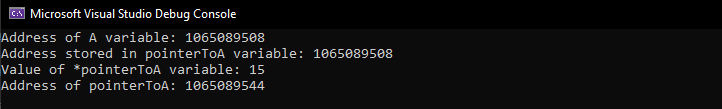
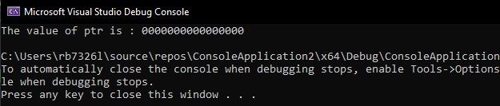
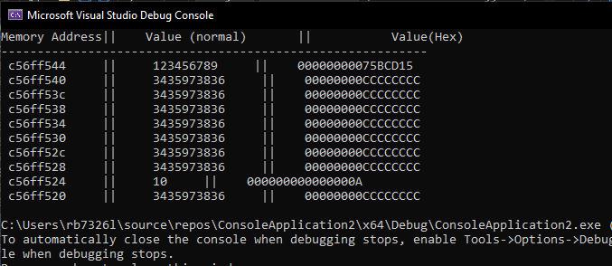
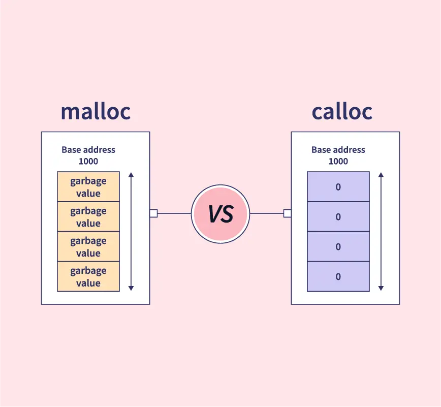
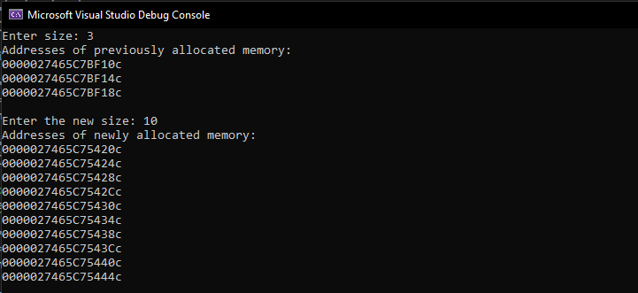

# Lab 6: C Pointers and Addressing

In this lab you will be introduce to pointers and addressing as tool to understand computer memory.

1. Create a new C++ Console project called `PointersAndAddressing`.
2. Remember to rename the `PointersAndAddressing.cpp` to `PointersAndAddressing.c`
3. Open `PointersAndAddressing.c` and modify to look like below: 

    ~~~admonish code

    ```c
    #include <stdio.h>

    int main(){

        return 0;
    }
    ```

    ~~~

## Section 1: Pointers

Now it's time to see the why C is used for the basis of nearly all programming languages, operating systems, and embedded code. 

Pointers in C are relativley easy and fun to learn. Some C programming tasks are performed more easily with pointers, and other tasks, such as dynamic memory allocation, cannot be performed without using pointers. 

Therefore it is necessary to learn pointers to become a perfect C programmer.

Let's start learning them in simple and easy steps.

Every variable is a memory location and every memory location has its address defined which can be accessed using ampersand `&` operator, which denotes an address in memory. 

4. Modify `main()` by entering the following code:

    ~~~admonish code

    ```
    ...
        int a=1, b =2 ,c =0;
    
        printf("Address for the variable a: %lu \n", (long)&a); // long casts the value in &a to a long integer, upto 32 bits
        printf("Address for the variable b: %lu\n", (long)&b);
        printf("Address for the variable c: %lu \n", (long)&c);
        return 0;
    }
    ```
    
    ~~~

    ~~~admonish info

    The `...` in the code blocks means that there is code above or below that remains the same.
    
    ~~~
    
    ~~~admonish output collapsible=true

    

    So it looks like the address are almost next to each other, we call this **contiguous**.
    
    ~~~

    ~~~admonish info

    - We must use format specifiers to tell the `printf()` how we would like our variables to be displayed.
    
    - So, `%` is the character for promising a specifier -> `%lu` means `unsigned long` and is 32 bits in size. 
    
    - memory address are **never** negative.

    ~~~

5. What would happen to the addresses if you ran the code again? **Try it!**

    ~~~admonish output collapsible=true

     

    You should have recieved different memory address locations, this because of the **Address Space Layout Randomiser** (ASLR) which provides a random address space for security reason. Consider if someone wanted to get certain information and new where it was stored all the time?

    ~~~


## Section 2: What are Pointers?

A **pointer** is a variable whose value is the address of another variable, i.e., direct address of the memory location. Like any variable or constant, you must declare a pointer before using it to store any variable address. The general form of a pointer variable declaration is `type var-name`.

Here, type is the pointer's base type; it must be a valid C data type and var-name is the name of the pointer variable. The asterisk `*` used to declare a pointer is the same asterisk used for multiplication. 

However, in this statement the asterisk is being used to designate a variable as a pointer. Take a look at some of the valid pointer declarations:

~~~admonish code

```c
int    *ip;    /* pointer to an integer */
double *dp;    /* pointer to a double */
float  *fp;    /* pointer to a float */
char   *ch     /* pointer to a character */
```

~~~

The actual data type of the value of all pointers, whether integer, float, character, or otherwise, is the same, a long hexadecimal number that represents a memory address. The only difference between pointers of different data types is the data type of the variable or constant that the pointer points to.

## Section 3: How to Use Pointers?

To use the pointer, a C language feature, you must do the following steps:

- **(a)** define a pointer variable,
- **(b)** assign the address of a variable to a pointer, and 
- **(c)** finally access the value at the address available in the pointer variable. 

This is done by using unary operator `*` that returns the value of the variable located at the address specified by its operand. The following example makes use of these operations.

6. Again edit the contents of `main()` to match below:

    ~~~admonish code

    ``` c
    #include <stdio.h>

    int main () {

        int  a = 15;      /* actual variable declaration */
        int  *pointerToA; /* pointer variable declaration */

        pointerToA = &a;  /* store address of var in pointer variable*/

        printf("Address of A variable: %lu\n", (long)&a);

        /* address stored in pointer variable */
        printf("Address stored in pointerToA variable: %lu\n", (long)pointerToA);

        /* access the value using the pointer */
        printf("Value of *pointerToA variable: %d\n", *pointerToA);
        
        /* address of the pointer itself */
            printf("Address of pointerToA: %lu\n", (long)&pointerToA);

        return 0;
    }
    ```

    ~~~

7. Run the code and you should see something similar to below,remember to compile first:

    ~~~admonish output collapsible=true

    

    ~~~

----

## Section 4: Null Pointers

It is always a good practice to assign a `NULL` value to a pointer variable in case you do not have an exact address to be assigned. 

This is done at the time of variable declaration. A pointer that is assigned `NULL` is called a `NULL pointer`.

The `NULL pointer` is a constant with a value of zero defined in several standard libraries. 

8. Modify `main()` and enter the following:

    ~~~admonish code

    ``` c
    #include <stdio.h>

    int main () {

    int  *ptr = NULL;

    printf("The value of ptr is : %p\n", ptr  );
    
    return 0;
    }
    ```

    ~~~

9. Run the program:

    ~~~admonish output collapsible=true
    
    

    ~~~

    - In most of the operating systems, programs are not permitted to access memory at address `0` because that memory is reserved by the operating system. 

    - However, the memory address 0 has special significance; it signals that the pointer is not intended to point to an accessible memory location. But by convention, if a pointer contains the `null` (zero) value, it is assumed to point to nothing.

    - To check for a null pointer, you can use an `if` statement as follows:

        ~~~admonish code

        ``` c
        if(ptr)     /* succeeds if p is not null */
        if(!ptr)    /* succeeds if p is null */
        ```

        ~~~

--------------

## Section 5: Pointers in Detail

Pointers have many but easy concepts and they are very important to `C` programming. The following important pointer concepts should be clear to any C programmer:

-  **Pointer arithmetic**

    There are four arithmetic operators that can be used in pointers:
    - `++` ,`--`, `+`, `-`

-  **Array of pointers**
   -  You can define arrays to hold a number of pointers.

- **Pointer to pointer**
   -  C allows you to have pointer on a pointer and so on.

- **Passing pointers to functions in C**
   -  Passing an argument by reference or by address enable the passed argument to be changed in the calling function by the called function.

-  **Return pointer from functions in C**
   -  C allows a function to return a pointer to the local variable, static variable, and dynamically allocated memory as well.


------------------- 

## Section 6: Exploring the memory

Now we can explore memory in a more detail way.

So one crucial thing to note here is that accessing memory locations and changes their values can be fatal for a system.

It is relativley simple to access memory addresses around your own entry point, let's assume you assign a variable called `a` and then you get the memory address. After you have this address you have a starting pointing to explore.

Modify `main()` with the following code snippets, remember to include the `#include<stdio.h>` and `int main(){return 0;}` lines of code:

1.  Define and assign an integer with the value 10, which we are going to use for looping.

    ~~~admonish code

    ``` c
    int bin = 10;
    ```

    ~~~

2.  Create another integer and this time give it the value 123456789.

    ~~~admonish code

    ``` c
    int value = 123456789:
    ```

    ~~~

3.  Initialise a new variable in the pointer region of the code to point to the address of `value`

    ~~~admonish code

    ``` c
    int* pointer = (&value);
    ```

    ~~~

4. Add the following `printf`s
   
   ~~~admonish code

   ```c
    printf("Memory Address        ||    Value        \n");
    printf("------------------------------------------\n");
   ```

   ~~~

5.  Now you need to write of the `for` loop to return the address the pointer holds and the value at that address.

    ~~~admonish code

    ``` c
    for (int i = 0; i < bin; ++i)
    {   


    }
    ```

    ~~~

6.  Inside the for loop between the braces { } enter this line to print out the values to console.

    ~~~admonish code 

    ``` c
    printf(" %lu      ||    %d \t\t \n",(unsigned long)
    
    pointer,(unsigned int)*pointer);
    ```

    ~~~

7.  Finally, we need to take one off of the pointer\'s value thereby decreasing the address. Add the following direcitly on the line below`printf();`

    ~~~admonish code
    
    ``` c
    pointer = pointer - 1;
    ```

    ~~~

    ~~~admonish code collapsible=true title='Suppressed Code ... [22 slines]'

    ```c
    #include <stdio.h>
    int main () {
       // define your variables in this region 
        int bin = 10;
        int value = 123456789;
        // end of variabl region

        // create a pointer here
        int* pointer = (&value);
        // end of pointer region
        
        printf("Memory Address||    Value (normal)       ||           Value(Hex)   \n");
        printf("-----------------------------------------------------------\n");

        // put the `for` loop here
        for (int i = 0; i < bin; ++i)
        {
            printf(" %x     ||     %u     ||    %p \t\t \n", (unsigned long)pointer, (unsigned int)*pointer, (unsigned int)*pointer);
            pointer = pointer - 1;
        }
        // end of for loop
        return 0;
    }
    ```

    ~~~


8. Run the code and you should see something like below: 


    ~~~admonish output collapsible=true
        
    

    ~~~

    ~~~admonish info
    
    Remember you will get different memory address and other than the `123456789` value the rest of the values are generally nonsense, unless they are used by the program.

    ~~~

   - Now that the script has executed you can see we have a list of 10 memory addresses and the values those address hold.

   - Again we see **contiguous** memory seperated by 4 byte address spaces.

   - We can see our the that on the first time the loop executes we get the memory address of our variable `bin` and the subsequent value of stored in the address `123456789`.

   - However, we can also see that as the for loop continues looping through we get our list of memory addresses and values inside those memory addresses.

## Subsection 6.1: Arrays

So lets quickly look at arrays from a memory prespective.

The `C` programming language can store arrays of any data type; `int`, `float`, `char`,... etc.

9.  This time we will store a `char[]` and print out the each element of the array and the corresponding memory address which will be formatted as a hexadecimal number. Modifiy `main()` to look like the following code:

    ~~~admonish code

    ``` c
    #include<stdio.h>
    #include<stdlib.h>
    int main ()
    {
        int n = 11, i;
        char ptr[11] = "hello world";
        
        printf ("\nPrinting elements of 1-D array: \n\n");
        for (i = 0; i < n; i++)
        {
            printf ("%c ", ptr[i]);
        }
        printf ("\n\nNow what is the memory location for each index and the array itself: \n\n");
        printf("      Memory Address (HEX)  ||  Element        Value\n");
        printf("----------------------------------------------------\n");
        
        //%p means type pointer
        for (i = 0; i < n; i++)
        {
            printf ("\t%p      ||   ptr[%d]    =    %c\n", &ptr[i], i, ptr[i]);
        }
        printf("----------------------------------------------------\n");
        printf("\t%p      ||   ptr[]     =  %c (this is the array's address too!) \n", &ptr,*ptr);
        
    
        return 0;
    }
    ```

    ~~~

9. Run this code and see the expected output below:

    ~~~admonish output collapsible=true

    

    - So you should be able to see that arrays are indeed **Contiguous**
    
    - The starting memory address of the array is the same the zeroth element (`h`). 
    
    ~~~


--------------------------------------

## Section 7: Dynamically Allocation of Memory

As you know, an array is a collection of a fixed number of values. Once the size of an array is declared, you cannot change it.

Sometimes the size of the array you declared may be insufficient. To solve this issue, you can allocate memory manually during run-time. This is known as dynamic memory allocation in C programming.

To allocate memory dynamically, library functions are `malloc()`, `calloc()`, `realloc()` and `free()` are used. These functions are defined in the `<stdlib.h>` header file.

### Subsection 7.1: `malloc()`

The name `malloc` stands for **m**emory **alloc**ation.

The `malloc()` function reserves a block of memory of the specified number of bytes. And, it returns a pointer of `void` which can be casted into pointers of any form.

~~~admonish code

```c
ptr = (castType*) malloc(size);
```

~~~

Example:

~~~admonish code

```c
ptr = (float*) malloc(100 * sizeof(float));
```

~~~

The above statement allocates 400 bytes of memory. It's because the size of `float` is 4 bytes. And, the pointer `ptr` holds the address of the first byte in the allocated memory.

The expression results in a `NULL` pointer if the memory cannot be allocated.

### Subsection 7.2: `calloc()`

The name `calloc` stands for contiguous allocation.

The `malloc()` function allocates memory and leaves the memory uninitialized, whereas the `calloc()` function allocates memory and initialises all bits to zero.

~~~admonish code

```c
ptr = (castType*)calloc(n, size);
```

~~~

Example:

~~~admonish code

```c
ptr = (float*) calloc(25, sizeof(float));
```

~~~

The above statement allocates contiguous space in memory for 25 elements of type `float`.



### Subsection 7.3: `free()`

Dynamically allocated memory created with either `calloc()` or `malloc()` doesn't get freed on their own. You must explicitly use `free()` to release the space.

~~~admonish code

```c
free(ptr);
```

This statement frees the space allocated in the memory pointed by `ptr`.

~~~

#### Example 1:

10. Modify `main()` again so that and reproduce the following code  so that the program dynamically allocates the memory for `n` number of `int`s using `malloc()` and `free()`:

    ~~~admonish code

    ```c
    // Program to calculate the sum of n numbers entered by the user

    #include <stdio.h>
    #include <stdlib.h>

    int main() {
    int n, i, *ptr, sum = 0;

    printf("Enter number of elements: ");
    scanf_s("%d", &n);

    ptr = (int*) malloc(n * sizeof(int));
    
    // if memory cannot be allocated
    if(ptr == NULL) {
        printf("Error! memory not allocated.");
        exit(0);
    }

    printf("Enter elements per line: ");
    for(i = 0; i < n; ++i) {
        scanf_s("%d", ptr + i);
        sum += *(ptr + i);
    }

    printf("Sum = %d", sum);
    
    // deallocating the memory
    free(ptr);

    return 0;
    }

    ```

    ~~~

11. Run the program and try to enter a number equal to or than greater that zero:

    ~~~admonish output collapsibl=true

    

    ~~~

### Example 2:

12. Modify `main()` again so that and reproduce the following code that dynamically allocates the memory for `n` number of `int` using `calloc()` and `free()`:

    ~~~admonish code

    ```c
    // Program to calculate the sum of n numbers entered by the user

    #include <stdio.h>
    #include <stdlib.h>

    int main() {
    int n, i, *ptr, sum = 0;
    printf("Enter number of elements: ");
    scanf("%d", &n);

    ptr = (int*) calloc(n, sizeof(int));
    if(ptr == NULL) {
        printf("Error! memory not allocated.");
        exit(0);
    }

    printf("Enter elements: ");
    for(i = 0; i < n; ++i) {
        scanf("%d", ptr + i);
        sum += *(ptr + i);
    }

    printf("Sum = %d", sum);
    free(ptr);
    return 0;
    }

    ```

    ~~~

13. Now, run the code and you should see the following output, remember to enter a number equal to or greater than zero:

    ~~~admonish output collapsibl=true


    

    ~~~


### Subsection 7.4: `realloc()`

If the dynamically allocated memory is insufficient or more than required, you can change the size of previously allocated memory using the `realloc()` function.

~~~admonish code

```c
ptr = realloc(ptr, x);
```

~~~

Here, `ptr` is reallocated with a new size `x`.

### Example 3:

14. Modify `main()` again so that and reproduce the following code that dynamically allocates the memory for `n` number of `int` using `malloc()`, `realloc()` and `free()`:

    ~~~admonish code

    ```c
    #include <stdio.h>
    #include <stdlib.h>

    int main() {
    int *ptr, i , n1, n2;
    printf("Enter size: ");
    scanf("%d", &n1);

    ptr = (int*) malloc(n1 * sizeof(int));

    printf("Addresses of previously allocated memory:\n");
    for(i = 0; i < n1; ++i)
        printf("%pc\n",ptr + i);

    printf("\nEnter the new size: ");
    scanf("%d", &n2);

    // rellocating the memory
    ptr = realloc(ptr, n2 * sizeof(int));

    printf("Addresses of newly allocated memory:\n");
    for(i = 0; i < n2; ++i)
        printf("%pc\n", ptr + i);
    
    free(ptr);

    return 0;
    }
    ```

    ~~~

15. Run the program and remeber the enter a number equal to or greater than zero:


    ~~~admonish output collapsibl=true

    

    ~~~

## Section *: Stack, Heap and Static

In addition to the lecture note here are more info about those concepts.

### Stack Memory

- **Description:** Stack memory is a region of memory that is used for storing local variables and function call information. It operates in a Last-In-First-Out (LIFO) manner, and memory is automatically allocated and deallocated as functions are called and return.

- **Definition:** Stack memory is a type of memory that stores local variables and function call information. It follows a Last-In-First-Out (LIFO) structure, and memory is automatically managed during function calls.

### Heap Memory:

- **Description:** Heap memory is a dynamic memory allocation area where memory is allocated and deallocated manually using functions like malloc and free. It allows for more flexible memory management but requires explicit memory cleanup.

- **Definition:** Heap memory is a dynamic memory allocation area where memory is manually allocated and deallocated using functions such as malloc and free. It provides flexibility in memory management but requires explicit cleanup.

### Static Memory

- **Description:** Static memory refers to memory allocated for variables that exist throughout the program's lifetime. It is typically used for global variables and static variables inside functions. Memory is allocated at compile-time and persists throughout the program's execution.

- **Definition:** Static memory is memory allocated for variables that have a fixed lifetime throughout the program. It includes global variables and static variables inside functions. Memory is allocated at compile-time and persists during the program's execution.

### Task

 - Create new file with `Mem_Types.c`, and write the following code:

- Sack Memory (stackMemory function):

  - Declares and prints a simple integer variable (stackVariable) on the stack.
  - Demonstrates automatic memory management within the function's scope.

- Heap Memory (heapMemory function):

  - Dynamically allocates memory for an integer array (heapArray) on the heap.
  - Initializes and prints the array, showcasing dynamic memory allocation.
  - Manually frees the allocated memory to prevent leaks.

- Static Memory (staticMemory function):

  - Declares and prints a static integer array (staticArray) with five elements.
  - Demonstrates static memory allocation with a persistent lifetime.

- Main Function (main function):

  - Calls each memory example function to showcase stack, heap, and static memory.
  - Highlights the unique features of each memory type.
  - Compile and run the program to observe the outputs for different memory types.

    ~~~admonish code

    ```c
    #include <stdio.h>
    #include <stdlib.h>

    void stackMemory() {
        // Stack memory example
        int stackVariable = 10;
        printf("Stack Variable: %d\n", stackVariable);
        // The stack variable exists only within this function's scope
    }

    //---------------

    void heapMemory() {
        // Heap memory example
        int *heapArray;
        int size;

        printf("Enter the size of the array: ");
        scanf("%d", &size);

        // Dynamically allocate memory for an array on the heap
        heapArray = (int*)malloc(size * sizeof(int));

        if (heapArray == NULL) {
            printf("Memory allocation failed\n");
            return;
        }

        // Initialize the array
        for (int i = 0; i < size; i++) {
            heapArray[i] = i * 2;
        }

        // Print the original array
        printf("Original Heap Array: ");
        for (int i = 0; i < size; i++) {
            printf("%d ", heapArray[i]);
        }
        printf("\n");

        // Don't forget to free the allocated memory when done
        free(heapArray);
    }
    //---------------

    void staticMemory() {
        // Static memory example
        static int staticArray[5] = {1, 2, 3, 4, 5};

        // Print the static array
        printf("Static Array: ");
        for (int i = 0; i < 5; i++) {
            printf("%d ", staticArray[i]);
        }
        printf("\n");
    }
    //---------------

    int main() {
        // Stack memory example
        stackMemory();

        // Heap memory example
        heapMemory();

        // Static memory example
        staticMemory();

        return 0;
    }
    ```
    
    ~~~

- By working through the examples and understanding the behaviors of variables in different memory regions, you should be better equipped to make informed decisions about memory allocation and deallocation in C programs.

## Section 9: Extra work

While `calloc` and `malloc` are both dynamic memory allocation functions in C, they serve distinct purposes. The primary benefit of using calloc over `malloc` lies in its ability to initialise the allocated memory to zero. This can be advantageous when dealing with arrays or structures that need to be zero-initialised, ensuring a consistent and predictable state.

However, it's essential to note that while `calloc` provides this initialization advantage, it may not be as time-efficient as `malloc`.

Explore the trade-off between zero-initialisation benefits and time efficiency when using `calloc` compared to `malloc` in C programming. Implement a program, measure execution times (Hint: timestamps `#include <time.h>`)(perhaps for allocating memory for an array type double with size of 1,000,000 items, or maybe more), and draw conclusions based on the collected data.