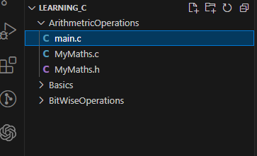
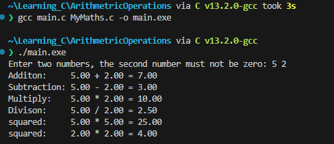
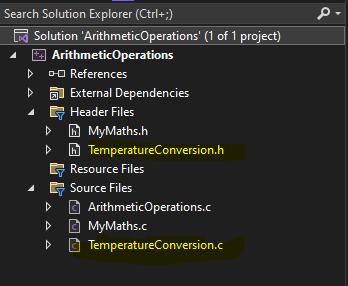
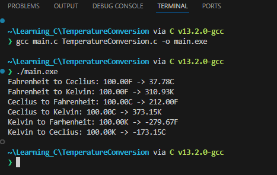
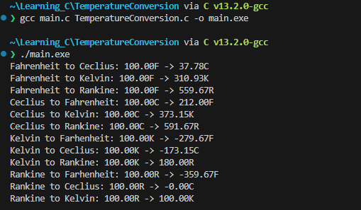

# Lab 3:  Arithmetic Operations

## Task 1

Write a program with functions to perform basic arithmetic operations (addition, 
subtraction, multiplication, and division). Each operation should be in its own function.

1. Open a new folder called `Arthimetic Operations`

2. Create a new header file by following the images below, and call the file `MyMaths.h`, `MyMaths.c`, and `main.c`:

   - 

3. Next create a Guard for the new header file: 
    ```h
    #pragma once

    #ifndef MYMATHS_H
    #define MYMATHS_H

    #endif
    ```

4. Now we are ready to place declare for reference various arithemtic functions. Add the following functions where the parameters are `floats`:
    - add
    - subtract
    - multiply
    - divide
    - square <p></p>

    <details>
    <summary>Possible Solution...</summary>

    ```h
    #pragma once

    #ifndef MYMATHS_H
    #define MYMATHS_H

    #include <stdio.h>

    float add(float a, float b);
    float subtract(float a, float b);
    float multiply(float a, float b);
    float divide(float a, float b);
    float square(float a);

    #endif // End of Guard
    ```

    </details>

5. To provide the actual code for each of these prototype functions in `MyMaths.h`, modify the  `MyMaths.c` file.

6. Modify the content on `MyMaths.c` so that it `includes` the `MyMaths.h` file:
    
    <details>
    <summary>Possible Solution...</summary>

    `#include "MyMaths.h"`

    </details>

7. Now start to build out the functionality of each of the arthimetic functions you declared in the `MyMaths.h` file:

    - add
    - subtract
    - multiply
    - divide
    - square <p></p>

    <details>
    <summary>Possible Solution</summary>

    ```c
    #include "MyMaths.h"

    float add(float a, float b)
    {
        return a + b;
    }

    float subtract(float a, float b)
    {
        return a - b;
    }

    float multiply(float a, float b)
    {
        return a*b;
    }

    float divide(float a, float b)
    {
        
        return a/b;
    }

    float square(float a)
    {
        return a*a;
    }
    ```

    </details>

8. Go back to `main.c` and modify the contents so that it `includes` `MyMaths.h` and remove the code in side the `main()` block (keeping the `return 0;`), do this now:

    <details>
    <summary>Possible Solution</summary>

    ```c
    #include "MyMaths.h"

    int main()
    {

        return 0;
    }
    ```

    </details>

9. Declare two `float`s as `num1` and `num2` initialising them with the value `0.0f` inside of `main()`:

    <details>
    <summary>Possible Solution</summary>

    ```c
    int main(){

        float num1 = 0.0f, num2 = 0.0f;

        return 0;
    }
    ```

    </details>

10. Using `printf`, request the user to enter two numbers, where second number that must be greater than zero. Then using `scanf` read what the user inputted and assign those two numbers to `num1` and `num2`.

    <details>
    <summary>Possible Solution</summary>

    ```c
    int main(){

        float num1 = 0.0f, num2 = 0.0f;
        printf("Enter two numbers, the second number must not be zero: ");
        scanf("%f %f", &num1, &num2);

        return 0;
    }
    ```

    </details>

11. Reproducing the following format perform each of the arithmetic operations on the supplied numbers, you will need to do square twice, one for each number: 

    `printf("<Arithemtic Operation>:     %.2f + %.2f = %.2f\n", num1, num2, arithmeticOpeation(num1, num2));`

    <details>
    <summary>Possible Solution</summary>

    ```c
    int main(){

    float num1 = 0.0f, num2 = 0.0f;
    printf("Enter two numbers, the second number must not be zero: ");
    scanf("%f %f", &num1, &num2);
    
    printf("Additon:     %.2f + %.2f = %.2f\n", num1, num2, add(num1, num2));
    printf("Subtraction: %.2f - %.2f = %.2f\n", num1, num2, subtract(num1, num2));
    printf("Multiply:    %.2f * %.2f = %.2f\n", num1, num2, multiply(num1, num2));
    printf("Divison:     %.2f / %.2f = %.2f\n", num1, num2, divide(num1, num2));
    printf("squared:     %.2f * %.2f = %.2f\n", num1, num1, square(num1));
    printf("squared:     %.2f * %.2f = %.2f\n", num2, num2, square(num2));

    return 0;
    ```

    </details>

12. **Output:**<p></p>

    <div align=center>

    

    </div>

------------------------------
------------------------------

## Task 2

Let's further modify the solution so we can do some meaningful programming. In this task you will create a temperature conversion tool. 

13. Create a new Header file and c file in the respective locations called:
    - `TemperatureConversion.h`
    - `TemperatureConversion.c`

<div align=center>



</div>

14. Open `TemperatureConversion.h` and add the guard for this file.

    <details>
    <summary>Possible Solution...</summary>

    ```h
    #pragma once
    #ifndef TEMPEATURECONVERSION_H
    #define TEMPEATURECONVERSION_H


    #endif
    ```

    </details>

15. Inside the block ifndef block define the functions to convert to and from fahrehnhiet, celcius and kelvin, so there should be six functions altogether. The functions should return a `float` and take only one `float` as an argument:

    <details>
    <summary>Possible Solution...</summary>

    ```h
    #pragma once
    #ifndef TEMPEATURECONVERSION_H
    #define TEMPEATURECONVERSION_H

    double fahrenheitToCelcius(double fahr);
    double fahrenheitToKelvin(double kel);

    double celciusToFahrenheit(double cel);
    double celciusToKelvin(double cel);

    double kelvinToCelcius(double kel);
    double kelvinToFahrenheit(double kel);

    #endif // TEMPEATURECONVERSION_H
    ```

    </details>

16. Next build up the `TempeatureConversion.c` file:
    - include the `TemperatureConversion.h` file
    - use the following formulas to convert between each temperature:
  
        - Fahrentheit to:
          -  \\( Celcius = \left(\frac{5.0}{9.0}\right) \cdot (fahr - 32.0)\\)

          -  \\(Kelvin = \left(\frac{(fahr -32.0)}{1.79999999}\right) + 273.15\\)

        - Celcius to:
          - \\( Fahrenheit = \left(cel \cdot \left(\frac{9.0}{5.0}\right)\right) +32.0\\)

          - \\( Kelvin = cel + 273.15\\)

        - Kelvin to:
          -  \\( Celcius = kel - 273.15 \\)

          - \\(Fahrenheit = ((kel - 273.15) * 1.8) + 32.00 \\)

    >**Note:**
    >> Remember that the function are defined in the `TemperatureConversion.h`. 

    <details>
    <summary>Possible Solution...</summary>

    ```c
    #include "TemperatureConversion.h"

    double fahrenheitToCelcius(double fahr) {
        return (5.0 / 9.0) * (fahr - 32.0);
    }

    double fahrenheitToKelvin(double fahr){
        return ((fahr - 32) / 1.79999999) + 273.15;
    }


    double celciusToFahrenheit(double cel){
        return (cel * (9.0 / 5.0))+ 32.0 ;
    }

    double celciusToKelvin(double cel) {
        return (cel + 273.15);
    }

    double kelvinToCelcius(double kel) {
        return (kel - 273.15 );
    }

    double kelvinToFahrenheit(double kel) {
        return ((kel - 273.15) * 1.8) + 32.00;
    }
    ```
    </details>

17. Navigate to `main.c` and include the `TemperatureConversion.h` file underneath `#include <stdio.h>` line.

18. Continuing lets comment out the previously written code for future reference incase we need it. Above the `float num1 = 0.0f, num2 = 0.0f` line add a `/*` place the proceeding `*/` on the last line of code in this block above the `return 0;`

  

19. To use our temperature functions, reproduce the following line and then replicate for the other temperature functions. I would suggest starting in the whitespace between `int main(){` and the `/*` line:

    ```c
    float num1 = 100.0f;

    printf("Fahrenheit to Ceclius: %.2fF -> %.2fC \n", num1, fahrenheitToCelcius(num1));
    ```

    >**Note:**
    >> Remember that the functions you have implemented return a double, so the second format specifier , `%.2f` will be the returned value.

    <details>
    <summary>Possible Solution</summary>

    ```c
    ...
    int main(){
        float num1 = 100.0f;

        printf("Fahrenheit to Ceclius: %.2fF -> %.2fC \n", num1, fahrenheitToCelcius(num1));

        printf("Fahrenheit to Kelvin: %.2fF -> %.2fK \n", num1, fahrenheitToKelvin(num1));

        printf("Ceclius to Fahrenheit: %.2fC -> %.2fF \n", num1, celciusToFahrenheit(num1));

        printf("Ceclius to Kelvin: %.2fC -> %.2fK \n", num1, celciusToKelvin(num1));

        printf("Kelvin to Farhenheit: %.2fK -> %.2fF \n", num1, kelvinToFahrenheit(num1));

        printf("Kelvin to Ceclius: %.2fK -> %.2fC \n", num1, kelvinToCelcius(num1));


        /*
        ...
        */
        return 0;
    }
    ```

    >**Note:**
    >> The `...` means and rest of the code, that I have ommitted for readibility 

    </details>

20. Run the code and you should see the following output:

    <div align=center>

    

    </div>

Congratulations you reached the end of the guided part of the lab, now try and do point 21 below.


-------------------------
-------------------------

21. If you get to here try and modify the code so that you can convert from above temperature units to Rankine and vice versa, the following formulas will help you:
    
    - Rankine to: 
      - \\(Celcius = (R − 491.67) \cdot \left(\frac{5}{9}\right) \\) 
      - \\(Fahrenheit = R − 459.67\\)
      - \\(Kelvin = R \cdot \left(\frac{5}{9}\right)\\)
   
    - ... to Rankine = :
      - \\(Celcius \cdot \left(\frac{9}{5}\right) + 491.67\\)
     
      - \\(Fahrenheit + 459.67\\)

      - \\(Kelvin * 1.8\\)<p></p>

    <details>
    <summary>Output...</summary>
    
    <div align=center>

    

    </div>

    </details> <p></p>

    <details>
    <summary>Possible Solutions...</summary>

    - **TemperatureConversion.c**
        ```c
        ...
        double fahrenheitToRankine(double fahr) {
            return fahr + 459.67;
        }

        double celciusToRankine(double cel) {
            return (cel * (9 / 5) + 491.67);
        }

        double kelvinToRankine(double kel){
            return kel * 1.8;
        }

        double rankineToFahrenheit(double ran) {
            return ran - 459.67;
        }
        double rankineToCelcius(double ran){
            return (ran - 491.67) * (5 / 9);

        }
        double rankineToKelvin(double ran){
            return ran * (9 / 5);
        }
        ```

    - **TemperatureConversion.h**
        ```h
        ...
        double fahrenheitToRankine(double fahr);
        double celciusToRankine(double cel);

        double kelvinToRankine(double kel);

        double rankineToFahrenheit(double ran) ;
        double rankineToCelcius(double ran);
        double rankineToKelvin(double ran);
        ```
    - **ArithmeticOperations.c**
        ```c
        ... 
        printf("Fahrenheit to Rankine: %.2fF -> %.2fR \n", num1, fahrenheitToRankine(num1));
        ...
        printf("Ceclius to Rankine: %.2fC -> %.2fR \n", num1, celciusToRankine(num1))
        ...
        printf("Kelvin to Rankine: %.2fK -> %.2fR \n", num1, kelvinToRankine(num1));
       
        printf("Rankine to Farhenheit: %.2fR -> %.2fF \n", num1, rankineToFahrenheit(num1));

        printf("Rankine to Ceclius: %.2fR -> %.2fC \n", num1, rankineToCelcius(num1));

        printf("Rankine to Kelvin: %.2fR -> %.2fK \n", num1, rankineToKelvin(num1));
        ```
    </details> <p></p>


    
