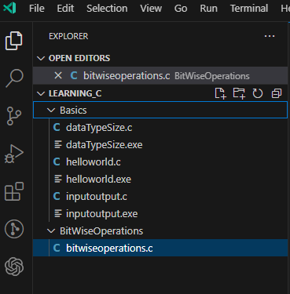
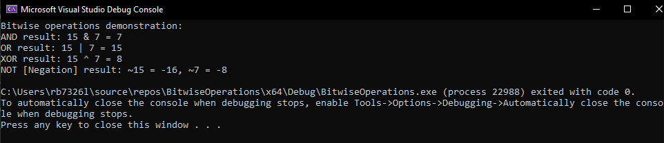

# Lab 2: Bitwise Operations

Bitwise operators are tools that operate on individual bits of integers, allowing us to manipulate binary data at the lowest level. In this walkthrough, you'll be guided through the process of crafting a C program that showcases the functionalities of bitwise AND, OR, XOR, and negation operations. These operations provide a powerful mechanism for fine-grained control over bits, which is particularly useful in scenarios where precision at the binary level is required.

----------------------
----------------------

## Reminder of Bitwise Operations

### 1. Bitwise AND (`&`):

The bitwise AND operator (`&`) performs a binary AND operation between corresponding bits of two integers. If both bits are 1, the result is 1; otherwise, it's 0.

Example:
```sql
0101   (5 in binary)
0011   (3 in binary)
----
0001   (Result: 1)
```

### 2. Bitwise OR (|):

The bitwise OR operator (|) performs a binary OR operation between corresponding bits of two integers. If at least one of the bits is 1, the result is 1; otherwise, it's 0.

Example:
```sql
0101   (5 in binary)
0011   (3 in binary)
----
0111   (Result: 7)
```

### Bitwise XOR (^):

The bitwise XOR operator (^) performs a binary XOR (exclusive OR) operation between corresponding bits of two integers. If the bits are different, the result is 1; if the bits are the same, the result is 0.

```sql
0101   (5 in binary)
0011   (3 in binary)
----
0110   (Result: 6)
```

### Bitwise NOT/Negation (~)

The bitwise NOT operator (~) performs a unary operation, inverting each bit of the operand. If the bit is 0, it becomes 1, and if the bit is 1, it becomes 0.

>**Note**
>> The result of the NOT operation is often interpreted in two's complement form for signed integers.

```sql
0101   (5 in binary)
----
1010   (Result: -6 in two's complement form)
```

----------------------
----------------------

## Task 1

1.  Create a new folder in `Learning_C\` and call it `BitwiseOperations`, then createa new file called`bitwiseoperations.c`


<div align=center>



</div>

2. Reproduce the following:

    ```c
    #include <stdio.h>
    int main(){

        return 0;
    }
    ```

3. After the `#include <stdio.h>` line add `void bitwiseOperations(int a, int b);`

4. Go to the closing `}` of `main()` and after it reproduce the following code to so that the declaration of the `bitwiseOperations()` actually does something:

    ```c

    void bitwiseOperations(int a, int b) {
        // AND operation
        int andResult = a & b;
        printf("AND result: %d & %d = %d\n", a, b, andResult);

        // OR operation
        int orResult = a | b;
        printf("OR result: %d | %d = %d\n", a, b, orResult);

        // XOR operation
        int xorResult = a ^ b;
        printf("XOR result: %d ^ %d = %d\n", a, b, xorResult);

        // Negation operation
        int negationA = ~a;
        int negationB = ~b;
        printf("Negation result: ~%d = %d, ~%d = %d\n", a, negationA, b, negationB);
    }
    ```
    - Bitwise AND (`&`):
        - `int andResult = a & b;` performs a bitwise AND operation between corresponding bits of integers `a` and `b`.
        - `printf("AND result: %d & %d = %d\n", a, b, andResult);` prints the result using the `%d` format specifier in the `printf` statement.

    - Bitwise OR (`|`):
        - `int orResult = a | b;` performs a bitwise OR operation between corresponding bits of integers `a` and `b`.
        - `printf("OR result: %d | %d = %d\n", a, b, orResult);` prints the result using the `%d` format specifier in the `printf` statement.

    - Bitwise XOR (`^`):
        - `int xorResult = a ^ b;` performs a bitwise XOR operation between corresponding bits of integers `a` and `b`.
        - `printf("XOR result: %d ^ %d = %d\n", a, b, xorResult);` prints the result using the `%d` format specifier in the `printf` statement.

    - Bitwise Negation (`~`):
        - `int negationA = ~a;` and `int negationB = ~b;` perform bitwise negation operations on integers `a` and `b`, respectively.
        - `printf("Negation result: ~%d = %d, ~%d = %d\n", a, negationA, b, negationB);` prints the negation results using the `%d` format specifier in the `printf` statement.

    These `printf` statements help visualize and understand the results of each bitwise operation by displaying the values of the operands and their outcomes. The `%d` format specifier is used to print integers in the output.


5. Modify `main()` to look like this: 

    ```c
    int main() {
        // Example values for demonstration
        int value1 = 15;
        int value2 = 7;

        printf("Bitwise operations demonstration:\n");
        bitwiseOperations(value1, value2);

        return 0;
    }
    ```

    ### Explanation of `main` Function:

    The `main` function serves as the entry point of the program. It is the function that is automatically called when the program is executed. Let's break down its components:

    - **Example Values:**
        - `int value1 = 15;` and `int value2 = 7;` declare two integer variables (`value1` and `value2`) and assign them example values. These values are chosen for demonstration purposes and will be used as operands in the bitwise operations.

    - **Function Call:**
        the example values `value1` and `value2` as arguments. This initiates the execution of the bitwise operations on these values.

    - **Print Statement:**
        - `printf("Bitwise operations demonstration:\n");` prints a message to the console indicating that the program is demonstrating bitwise operations. This provides a clear context for the output that follows.

    - **Return Statement:**
        - `return 0;` signifies the successful completion of the program. In C, a return value of 0 conventionally indicates that the program executed without errors.

6.  Run the program and predict the outputs: 

    <details>
    <summary>Output...</summary>

    

    </details>

----------------------
----------------------


## Task 2

7. Modify the program to take user input for the values of `value1` and `value2` instead of using predefined values. This will allow you to interactively input values and observe the bitwise operations in action.

8. Add more bitwise operations to the `bitwiseOperations` function. For example, introduce left shift (`<<`) and right shift (`>>`) operations. Explain their purpose and demonstrate their usage.

    <details>
    <summmary>Sample Code</summary>

    ```c
    // Left shift operation
    int leftShiftResult = a << 1;
    printf("Left Shift result: %d << 1 = %d\n", a, leftShiftResult);

    // Right shift operation
    int rightShiftResult = b >> 1;
    printf("Right Shift result: %d >> 1 = %d\n", b, rightShiftResult);

    ```

    </details>

9. Modify the `printf` statements to display the results in hexadecimal format using `%x` format specifier. This will introduce you to the hexadecimal representation of numbers.


    <details>
    <summmary>Sample Code</summary>

    ```c
    printf("AND result: %d & %d = %x\n", a, b, andResult);
    // Repeat for other operations
    ```

    </details>

10. Experiment with bit manipulation techniques. For example, check if a specific bit is set or unset, and set or clear a particular bit.

    <details>
    <summmary>Sample Code</summary>

    ```c
    // Check if the 3rd bit is set in a
    if ((a & (1 << 2)) != 0) {
        printf("3rd bit is set in %d\n", a);
    } else {
        printf("3rd bit is not set in %d\n", a);
    }

    // Set the 4th bit in b
    b = b | (1 << 3);
    printf("After setting 4th bit: %d\n", b);
    ```

    </details>