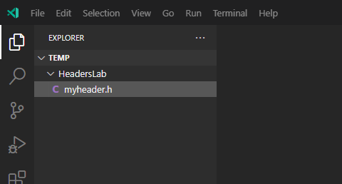
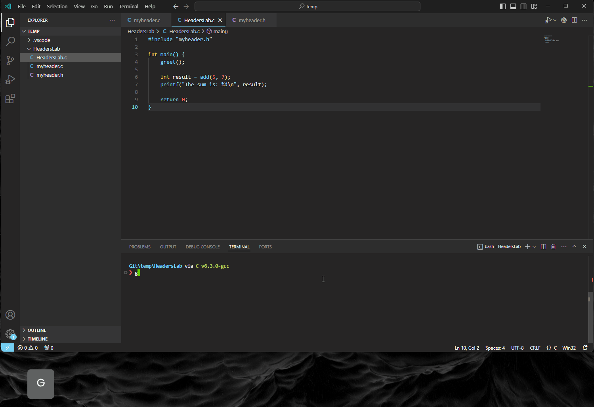

# Lab 5: Header Files, Header Guards, and Macros in C

In this lab, we'll explore key concepts in C programming that enhance code organization and reusability.

## Modular Programming

Modular programming involves breaking down a program into smaller, manageable modules. Each module focuses on a specific task, promoting easier maintenance and collaboration.


## Need for Header Files
Header files serve as containers for function declarations, allowing us to separate the declaration (interface) from the implementation (code). This separation simplifies code organization and supports reusability.

## Benefits of Code Separation and Reusability

By using header files, we can:

- Organize Code: Group related functions and declarations in separate files.

- Improve Readability: Focus on high-level functionality without getting lost in details.

- Facilitate Reusability: Easily reuse functions in different parts of a program or in other projects.

------------------------------------------
------------------------------------------

## Task 1: Header Files 

>**So What is a Header File?**
>>
>> A header file is a file containing declarations and macro definitions that can be shared between multiple source files. Commonly used header files, such as `stdio.h`, `stdlib.h`, and `math.h`, provide essential functions and constants.

1. Open visual studio code and open an existing folder or make a new one and call it something meaningful like `HeadersLab`.
   
2. Create a new header file in the header folder of the project view as seen below, call it, `myheader.h`

<div align=center>




</div>

3. Open the newly created header file and add a guard using the the keywords, `#ifndef`, `#define` and `#endif`. In at the end of `#ifndef` and `#define`, write the name of the header file in captial letters, and replace the `.h` with `_h`.

    <details>
    <summary>Solution...</summary>

    ```h
    // myheader.h
    #ifndef MYHEADER_H
    #define MYHEADER_H

    #endif // MYHEADER_H

    ```

    </details>

4. Inside the ifndef and endif block add a declaration/definition for a `greet` function that returns `void` and has no arguments and a second function called `add` that returns an `int` and takes two arguments that are `int`s:

    <details>
    <summary>Solution...</summary>

    ```h
    // myheader.h
    #ifndef MYHEADER_H
    #define MYHEADER_H

    // Function declarations
    void greet();
    int add(int a, int b);
    
    #endif // MYHEADER_H

    ```

    </details>
    
5. Now create the `myheader.c` file that will provide the functionality of the `myheader.h` decalarations. Once created reproduce the following:

    ```c
    #include <stdio.h>
    #include "myheader.h"

    void greet() {
        printf("Hello, welcome to the workshop!\n");
    }

    int add(int a, int b) {
        return a + b;
    }
    ```

    You can see the that the `"myheader.h"` has different syntax to `<stdio.h>`. This is because `<someheader.h>` is part of the global library of header files that come with the C/C++ compilers. Whereas, the `"someotherheader.h"` indicates that this file is located somewhere else, defined generally by the user. The location is generally part of the project folder, but can be located else and you simply provide the path to it `"/path/to/file.h"`

6. Go back to the the `HeadersLab.c` file where the `main() `function is and include the `"myheader.h"` at the top of the script. 

7. Inside the `main()`, before the `return` keyword:
   - write `greet()` function
   - on the next line assign the returned `int` as `result` value from `add()`, supply 5 and 7 as the arguments. 
   - Finally, use the `prinf()` to output the `result`, you can use this format/syntax:
     -  `printf("some string: %d\n", result)`.
     -  Where the format specifier, `%d`, means digit/denary. <p></p>
  
    <details>
    <summary>HeadersLab.c code</summary>


    ```c
    // main.c
    #include "myheader.h"

    int main() {
        greet();
        
        int result = add(5, 7);
        printf("The sum is: %d\n", result);

        return 0;
    }
    ```

    </details>

8. Run the program and you should recieve the following:

    **Output:**
    <div align=center>

    

    </div>

------------------------------
------------------------------

## Task 2: Macros

Macros are a powerful feature in C that allow us to define constants and perform code substitution. Let's explore their basic syntax and advantages.

**Commonly Used Macros**

Common macros, such as `#define PI 3.14`, simplify code maintenance by replacing repetitive values with named constants. **Macros** also play a role in conditional compilation using `#ifdef`, `#ifndef`, and `#endif`.

>**Note:**
>> The `#include` directive is used to include the contents of a file in another file. The inclusion happens during the preprocessing phase, before the actual compilation. It's used to include header files that contain declarations, macro definitions, and other necessary information so it is not a macro itself.

9. Let's modify our current `HeaderLab.c` file to includes some macros. after the `#include` directives and the macro `#define PI 3.14159`

>**Note:**
>> Macros variables/functions names follow a UPPERCASE name convention. 

10. Inside `main()` use `printf()` to output PI to the terminal. 

    ```c
    #include "myheader.h"
    #define PI 3.14159

    int main() {
        
        printf("PI is: %.5f\n", PI);
        greet();
        
        int result = add(5, 7);
        printf("The sum is: %d\n", result);

        return 0;
    }
    ```

2.  Run and you should see the following output:

    **Output**:

     <!--Output of PI-->

3.  Continuing, define a second macro as function that computes the square of a number:
    ```c
    #define SQUARE(x) ((x) * (x))
    ```
    This function only use 4 Byte values, so anything larger than a `int` would not work. 

4.  Inside `main()` call the macro defined function SQAURE inside a printf statement, where the statement outputs the result of the SQUARE and the number being squared:

    ```c
    int num = 5;
    printf("The square of %d is: %d\n", num, SQUARE(num));
    ```

5.   Run the program and you should see the following:

      <!--Output of programming runnning-->

6.  Laslty we are going to look a very common marco useage implementing debugging. Reproduce the following at the top of the file,above the `#include` directive:

    ```c
    // Example of conditional compilation macros
    #define DEBUG_MODE 1

    #ifdef DEBUG_MODE
    #define DEBUG_PRINT(msg) printf("Debug: %s\n", msg)
    #else
    #define DEBUG_PRINT(msg)
    #endif
    ...
    ```

7.  `Inside main()` place this `DEBUG_PRINT("This is a debug message");` :
    ```c
    int main() {

    printf("PI is: %.5f\n", PI);

    int num = 5;
    printf("The square of %d is: %d\n", num, SQUARE(num));

    DEBUG_PRINT("This is a debug message");
    ...
    ```
8.  If you run this program the you should see the following output:

    

9.  Remove the macro `DEBUG_MODE` and run the program again.

    <details>
    <summay></summary>

    

    This is because `DEBUG_MODE` is no longer defined so the `DEBUG_PRINT()` isn't invoked now.

    </details>

>**Note:**
>> The term **debugging** can be traced back to Admiral Grace Hopper, who worked at Harvard University in the 1940s. When one of her colleagues found a moth impeding the operation of one of the university's computers, she told them they were debugging the system. Computer programmers were first recorded as using the terms bugs and debugging by the 1950s, and by the early 1960s, the term debugging was commonly accepted in the programming community.


--------------------------
--------------------------


## Task 3: Advanced Macros

Here you will explore the varadic, Stringification, Marcros as Data structures, and Guarded Macros for Header Files.

22. **Variadic** macros extend the function-like macros to handle a variable number of arguments using variadic macros. For example you can create your own macro for `printf`, try the following:

    ```c
    // Example of a variadic macro for printing values
    #define PRINT_VALUES(...) printf("Values: " __VA_ARGS__)

    // Usage in a C program
    #include <stdio.h>

    int main() {
        PRINT_VALUES("%d, %f, %s\n", 10, 3.14, "Hello");
        return 0;
    }
    ```
    **Output**:

    

    **Explanation of code:**

    - `#define`: This is the preprocessor directive used to define macros in C.

    - `PRINT_VALUES`: This is the name of the macro being defined.

    - `(...)` (ellipsis): The ellipsis `(...)` in the parameter list indicates that the macro accepts a variable number of arguments. It is a feature known as variadic macros.

    - printf("Values: " __VA_ARGS__): This is the body of the macro. It's essentially a printf statement that prints a formatted string. The __VA_ARGS__ is a special identifier in C that represents the variable arguments passed to the macro.

    >**Challenge:**
    >> Can you create your own variadic macros and experiment with different argument types and formats.

23. Stringifcation(`STRINGIFY`):

    The `STRINGIFY` macro takes a single argument `x` and converts it into a string literal. The `#` operator, when used before an argument in a macro, is called the **stringification** operator. It converts the argument into a string.

    ```c
    #define STRINGIFY(x) #x
    ```
24. Reproduce the following:
    
    ```c
    // Example of stringification and token pasting
    #define STRINGIFY(x) #x

    // Usage in a C program
    #include <stdio.h>

    int main() {
        printf("Stringified: %s\n", STRINGIFY(Hello));
                
        return 0;
    }
    ```

    **Explanation:**

    - Stringification Example (`STRINGIFY`):

      - The macro `STRINGIFY(Hello)` converts the identifier Hello into the string literal `"Hello"`.
     
      - The `printf` statement prints `"Stringified: Hello\n"` to the console.

25. These features are useful in advanced macro usage, especially in situations where the names of identifiers need to be converted into strings during preprocessing.

-------------------------------
-------------------------------

## Task 3: Header Guards with Macros

26. The `mymacros.h` header file below encapsulates commonly used macros for maximum and minimum operations, as well as conditional debugging output. By using include guards, it ensures that the content is included only once in each compilation unit, avoiding redefinition issues. This header file can be included in C programs that require these macros for enhanced functionality and debugging capabilities.

27. You would `#include "mymacros_h"` in your file with `main()` and then #define DEBUG_MODE with 0 or 1, you can then access those functions.

    ```C
    // Example of header file with guarded macros
    #ifndef MYMACROS_H
    #define MYMACROS_H

    #define MAX(a, b) ((a) > (b) ? (a) : (b))
    #define MIN(a, b) ((a) < (b) ? (a) : (b))

    #ifdef DEBUG_MODE
        #define DEBUG_PRINT(msg) printf("Debug: %s\n", msg)
    #else
        #define DEBUG_PRINT(msg)
    #endif

    #endif // MYMACROS_H
    ```

28. Try and do this now.


----------------------------------
----------------------------------

## Task 4 Macros in Data Structures:

29. The code below is an example of using macros to define a *generic structure* for a linked list node in C. This allows you to create linked lists for different data types using the same basic structure **template**. 

    ```c
    // Example of macros for a linked list
    #define DECLARE_NODE_TYPE(type) \
        struct type##_Node {          \
            type data;                \
            struct type##_Node* next; \
        }

    DECLARE_NODE_TYPE(int);
    ```

    Let's break down the key components and explain how this works:

    - `DECLARE_NODE_TYPE`(type) Macro:
        - This macro is designed to declare a structure template for a linked list node.
        - The type parameter allows the user to specify the data type of the elements that the linked list will store.
        - The `##` operator concatenates the type with the `"_Node"` suffix to form the structure name

30. The `main()` function below,
    
    ```c
    #include <stdio.h>

    ...
    
    int main() {
        // Declare a linked list node for integers
        struct int_Node myNode;
        myNode.data = 42;
        myNode.next = NULL;

        printf("Data: %d\n", myNode.data);

        return 0;
    }
    ```

    - In the `())` function, a linked list node for integers is declared using the `DECLARE_NODE_TYPE(int)` macro. This creates a structure named `int_Node` with fields for storing data of type `int` and a pointer to the next node in the list.

    - An instance of the structure, `myNode`, is then created and initialised with a data value of `42` and a `NULL` pointer for the next node.

    - The program prints the data value of the node, which is `42`, to the console.

31. Reproducing the following and try with `int`, `float`, `double`, `char`:
    ```c
    // Example of macros for a linked list
    #define DECLARE_NODE_TYPE(type) \
        struct type##_Node {          \
            type data;                \
            struct type##_Node* next; \
        }

    DECLARE_NODE_TYPE(int);

    // Usage in a C program
    #include <stdio.h>

    int main() {
        struct int_Node myNode;
        myNode.data = 42;
        myNode.next = NULL;

        printf("Data: %d\n", myNode.data);
        
        return 0;
    }
    ```

32. Run the code to see the output: 

    

33. Modify and make a declare a node type as type `float`, and run again.

## Benefits: 

- **Generic Data Structures:** The use of macros allows for the creation of a generic template for linked list nodes, making it easy to declare nodes for different data types without duplicating code.

- **Code Reusability:** The same set of macros can be reused for various data types, reducing the need to rewrite code for each specific type.

- **Consistency:** By using macros, you ensure that the structure and naming conventions are consistent across different instances of linked lists.

## Considerations:

- Error Handling: The provided example doesn't include error handling, such as checking for malloc failures when allocating memory for nodes. In a real-world scenario, you would need to add appropriate error handling.

- Type Safety: While macros provide a way to create generic structures, they lack type safety. Users need to be cautious and ensure that the macros are used correctly with appropriate data types.

---------------------------
---------------------------

## Conclusion:
The use of macros in this example simplifies the creation of linked list nodes for different data types, promoting code reuse and consistency. This approach is particularly useful when you want to create generic data structures that can handle various types of data in a C program.