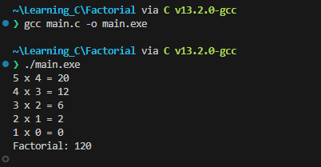
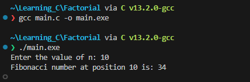

# Lab 4: Recursion

Recursion is a programming concept where a function calls itself in its own definition. In other words, a recursive function is a function that solves a problem by solving smaller instances of the same problem. This process continues until a **base case** is reached, at which point the function **returns** a result without making a recursive call.

Recursion consists of **two** main components:

1. **Base Case**: 
   - This is the terminating condition that prevents the function from calling itself indefinitely. When the base case is met, the recursion stops, and the function returns a specific value.

2. **Recursive Case**: 
   - This is the part of the function where it calls itself with a smaller or simpler input. Each recursive call should bring the problem closer to the base case.


-----------------------------------
-----------------------------------

## Task 1.

1. First recursive task is to perform a factorial, to do this we need a new project. Open VSCode and create a new C++ console project, and call it Factorial.

>**Note:**
>>
>>    As a reminder the factorial of a non-negative integer \\( n \\), denoted by \\( n! \\), is the product of all positive integers less than or equal to \\( n \\). It is defined as:
>>
>>    \\[ n! = n \times (n-1) \times (n-2) \times \ldots \times 2 \times 1 \\]
>>
>>For example:
>>
>>    \\[ 5! = 5 \times 4 \times 3 \times 2 \times 1 = 120 \\]
>>
>>The factorial function is often used in combinatorics and probability, where it represents the number of ways to arrange \\(n \\) distinct objects into a sequence.


1. Change the extension of the `Factorial.cpp` to `Factorial.c`

    <div align=center>

    

    </div>

2. Reproduce the following:
    ```c
    #include <stdio.h>

    int main(){

        return 0;
    }
    ```

3. Underneath the line `#include <stdio.h>` add the defintion of a new function called factorial that returns an `int` and takes one argument which is also an `int`.
   <details>
   <summary>Solution</summary>

    ```c
    int factorial(int n);
    ```

   </details>

<p></p>

4. After the closing `}` of `main()` write the factorial function that has just been defined, write the head and leave the body empty. 

    <details>
    <summary>Solution</summary>

    ```c
    int main(){
        ...
    }

    int factorial(int n){

    }
    ```

    </details>

5. Inside the factorial function write an if statement that checks if `n` is `0` or `1`, and if true, it returns `1`. Add a comment to the top of the if block that says `\\base case`. 


    <details>
    <summary>Possible Solution</summary>

    ```c
    int factorial(int n) {
        // Base case
        if (n == 0 || n == 1) {
            return 1;
        }
    }
    ```

    </details>

6. Now add the recusive case which will be the `else` block. Write the `return` keyword after the inside the `else{}` block. Continuing on the same line multiply `n` to the result of the factorial function invocation (the recursion). The `factorial()`'s argument should be `n - 1`

    <details>
    <summary>Possible Solution</summary>

    ```c
    int factorial(int n) {
        // Base case
        if (n == 0 || n == 1) {
            return 1;
        }else {
            // Recursive case
            return n * factorial(n - 1);
        }
    }
    ```

    </details>


7. Now revist `main()` and create a variable called `result` which is of the data type `int` which stores the result of the `factorial(5)` as part of it's declaration and initilaisation. On the next line print the variable `result` the prepened string `"Factorial: "`


    <details>
    <summary>Possible Solution</summary>

    ```c
    int main() {
        // Example usage
        int result = factorial(5);
        printf("Factorial: %d\n", result);  // Output: 120

        return 0;
    }
    ```
    </details>

8. Run the program and you should see the following:

    <div align=center>

    

    </div>

9. Modifying the factorial function more, you could try and output each result per recursion. Add the following `printf` call in the `else` block above the `return` line:

```c
printf("%d x %d = %d\n",n, (n-1), n * (n - 1));
```
10. Try printing and see what happens?

    <details>
    <summary>Output</summary>

    

    So why is this happening, the result is 120 but here it would appear that 2,880 = 20 x 12 x 6 x 2

    ```sql
    Call: factorial(5)
    |
    └── Print: 5 x 4 = 20
    └── Call: factorial(4)
        |
        └── Print: 4 x 3 = 12
        └── Call: factorial(3)
            |
            └── Print: 3 x 2 = 6
            └── Call: factorial(2)
                |
                └── Print: 2 x 1 = 2
                └── Call: factorial(1)
                |   Base Case: return 1
                └── Returned: 2 x 1 = 2
            └── Returned: 3 x 2 = 6
        └── Returned: 4 x 6 = 24
    └── Returned: 5 x 24 = 120
    Final Result: 120
    ```
    
    This diagram shows the sequence of recursive calls and how each call contributes to the final result of 120. The **base case** is reached when *n=1*, and the recursion starts unwinding, multiplying the results as it goes back up the chain of calls. The final result is the product of all the values calculated during the recursion.

    The final result is still 120, but the print statements highlight the individual multiplicative steps in the computation

    </details><p></p>


<details>
<summary>Code without print statement</summary>

```c
#include <stdio.h>

// Function prototype
int factorial(int n);

int main() {
    // Example usage
    int result = factorial(5);
    printf("Factorial: %d\n", result);  // Output: 120

    return 0;
}

// Function definition
int factorial(int n) {
    // Base case
    if (n == 0 || n == 1) {
        return 1;
    } else {
        // Recursive case
        return n * factorial(n - 1);
    }
}
```

</details><p></p>

-----------------------------
-----------------------------

## Task 2.

In this task you will create a recursive function to generate the *n*th term of the Fibonacci series.

<div align=center>

0, 1, 1, 2, 3, 5 , 8, 13, 21, 34,…

</div>

Here’s how the sequence progresses:

- Start with 0 and 1.

- The next number is 0 + 1 = 1.
- The next number is 1 + 1 = 2.
- The next number is 1 + 2 = 3.
- The next number is 2 + 3 = 5. And so on...

Simplified the formula looks like: 

\\[𝐹(𝑛) = 𝐹(𝑛 − 1) + 𝐹(𝑛 − 2)\\]

11. Modify the `Recursion.c` file so that the `factorial()` call and `printf` statement is commented out:

    ```c
    ...
    int main() {

        /*int result = factorial(5);
        printf("\nFactorial: %d\n", result);  // Output: 120
        */

        return 0;
    }
    ..   
    ```

12. Declare a new function underneath `int factorial(int n);` called `fibonacci` that returns and takes an integer as an argument:

    <details>
    <summary>Solution</summary>#

    ```c
    int fibonacci(int n);
    ```

    </details>


13. Now create the function body underneath the closing brace of `main()`:

    ```c
    ...
    int fibonacci(int n){
        //base case
        if (n <=1 ){
            return n;
        }
        else{
            // Recursive case
            return fibonacci(n -1) + fibonacci(n -2);
        }
    }

    int factorial(int n)
    ...
    ```

14. Go back to the `main()` function and enter the following:

    ```c
    int main(){

        int n;

        printf("Enter the value of n: ");
        scanf_s("%d", &n);

        // check if the input is non-negative
        if(n < 0){
            printf("Fibonacci sequence is not defined for negative numbers.");
        }else{
            int fibVaule = fibonacci(n - 1);
            printf("Fibonacci number at position %d is: %llu\n", n, fibValue);
        }

        ...

        return 0;
    }

    ```

15. Run the code and supply the 10 as the value for the prompt:

    **Output**

    <div align=center>

    

    </div>

16. Modifying the fibonacci function more, you could try and output each result per recursion. Add the following `printf` call in the `else` block above the `return` line:

```c
printf("(%d - 1) + (%d - 2) = %d\n", n, n, (n - 1) + (n - 2));
```
10. Try running and see what happens?

    <details>
    <summary>Output...</summary>

    

    Digrammitcally the program the recurison happens like this: 

    
    ```sql
    Call: fibonacci(5)
    |
    └── Print: (5 - 1) + (5 - 2) = 5
    └── Call: fibonacci(4)
        |
        └── Print: (4 - 1) + (4 - 2) = 5
        └── Call: fibonacci(3)
            |
            └── Print: (3 - 1) + (3 - 2) = 3
            └── Call: fibonacci(2)
                |
                └── Print: (2 - 1) + (2 - 2) = 1
                └── Call: fibonacci(1)
                    Base Case: return 1
                    Returned: 1
                └── Call: fibonacci(0)
                    Base Case: return 0
                    Returned: 0
                Returned: 1
            Returned: 2
        Returned: 3
    Returned: 5
    Final Result: Fibonacci number at position 5 is: 5
    ```

    The textual representation above shows the recursive calls and their relationships for the Fibonacci sequence with `n = 5`. Let's break down the structure and explain each part:

    - **Call: fibonacci(5)**
        - This is the initial call with \(n = 5\).
        - It prints the sum of the two preceding Fibonacci numbers for the current level.

    - **Call: fibonacci(4)**
        - This is a recursive call from the first level with \(n = 4\).
        - It prints the sum of the two preceding Fibonacci numbers for the current level.

    - **Call: fibonacci(3)**
        - This is a recursive call from the second level with \(n = 3\).
        - It prints the sum of the two preceding Fibonacci numbers for the current level.

    - **Call: fibonacci(2)**
        - This is a recursive call from the third level with \(n = 2\).
        - It prints the sum of the two preceding Fibonacci numbers for the current level.

    - **Call: fibonacci(1) and fibonacci(0)**
        - These are base cases, and they don't print the sum.
        - They return 1 and 0, respectively.

    The diagram shows the hierarchy of recursive calls, where each node represents a call to the `fibonacci` function with a specific value of \(n\). The "Print" lines indicate where the sum is printed. The "Returned" lines indicate the value returned from a particular call.

    The final result is printed at the bottom as "Final Result: Fibonacci number at position 5 is: 5". This is the cumulative result obtained by adding the values returned from the recursive calls.

    This kind of diagram is useful for visualizing the flow of recursive calls and understanding how the function evaluates the Fibonacci sequence for a given input.

    </details><p></p>

------------------------------
------------------------------

<details>
<summary>Full Lab code...</summary>

```c
#include <stdio.h>

// Function prototype
int factorial(int n);
int fibonacci(int c);
int sizeofthearray(int* arr);

int main() {

    int n;

    printf("Enter the value of n: ");
    scanf_s("%d", &n);

    // check if the input is non-negative
    if (n < 0) {
        printf("Fibonacci sequence is not defined for negative numbers.");
    }
    else {
        int fibValue = fibonacci(n - 1);
        printf("Fibonacci number at position %d is: %llu\n", n, fibValue);
    }

    int result = factorial(5);
    printf("\nFactorial: %d\n", result);  // Output: 120
    
    return 0;
}

int sizeofthearray(int* arr)
{
    size_t some_array_n = sizeof(arr) / sizeof(arr[0]);
    printf("Size of array is: %ld", some_array_n);
}


int fibonacci(int n) {
    //base case
    if (n <= 1) {
        return n;
    }
    else {
        printf("(%d - 1) + (%d - 2) = %d\n", n, n, (n - 1) + (n - 2));
        return fibonacci(n - 1) + fibonacci(n - 2);
    }
}


int factorial(int n) {
    // Base case
    if (n == 0 || n == 1) {
        
        return 1;
    }
    else {
        // Recursive case
        printf("%d x %d = %d\n",n, (n-1), n * (n - 1));
        return n * factorial(n - 1);
    }
}
```

</details><p></p>

------------------------------
------------------------------


## Conclusion

Recursion is a powerful and elegant technique, but it should be used with caution. Improper use of recursion can lead to **stack overflow** errors, and in some cases, it might be less efficient than iterative solutions. However, for certain problems, recursion can provide a clearer and more concise solution.