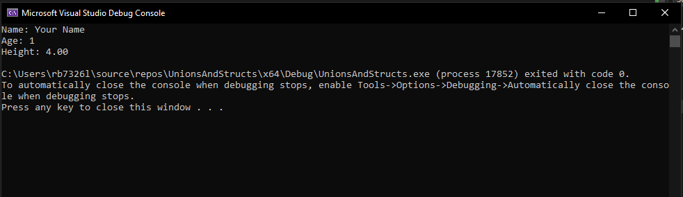
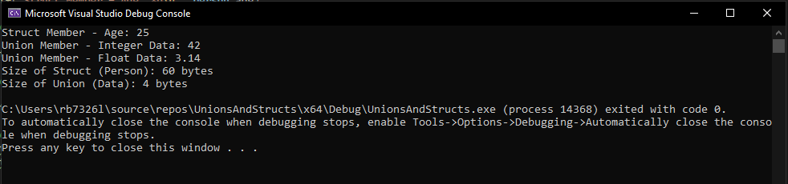
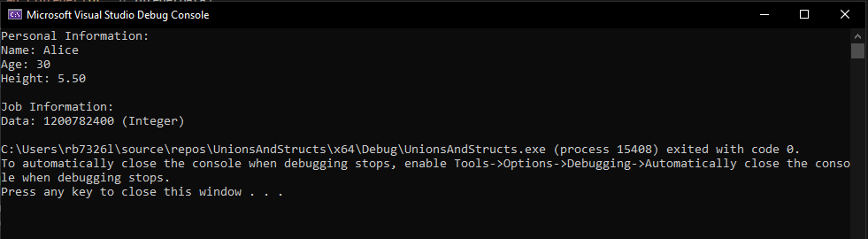

# Lab 7: Unions and Structs

 - You need to open a new Visual Studio Code, give it a meaningful name. 
 - Create a new file called `unionsandstructs.exe` 
 - modify the contents to look like this:
 - ~~~admonish code
   ```c
   #include <stdio.h>

   int main(){


       return 0;
   }
   ```

   ~~~

## Exercise 1: Structs

Objective: Understand the concept of structs and their usage in C.

1. Create a C program that defines a `Person` `struct` with the following attributes:

    - `name` (string)
    - `age` (integer)
    - `height` (float)

2. Write a function `printPerson` that takes a `Person` `struct` as a parameter and prints its attributes.

3. In the main function, create an instance of the `Person` `struct`,populate its attributes with your name, age and height, and use the `printPerson` function to display the details.

4. ~~~admonish output

   
   
   ~~~

5.  ~~~admonish code collapsible=true title='Suppressed Code... [29 lines]'

    ```c
    #include <stdio.h>

    /**
    * @struct Person
    * @brief Represents information about a person.
    */
    struct Person {
        char name[50]; ///< Name of the person.
        int age;       ///< Age of the person.
        float height;  ///< Height of the person.
    };

    /**
    * @brief Prints details of a person.
    * @param p The person to be printed.
    */
    void printPerson(struct Person p) {
        printf("Name: %s\nAge: %d\nHeight: %.2f\n", p.name, p.age, p.height);
    }

    /**
    * @brief Main function where the program starts execution.
    */
    int main() {
        // Create an instance of Person, initialize its attributes, and print details
        struct Person person1 = {"Your Name", 1, 4.0};
        printPerson(person1);

        return 0;
    }
    ```

    ~~~


---------------------------------------
---------------------------------------

## Exercise 2: Unions
Objective: Explore the concept of unions and their applications in C.

1. Create a C program that defines a `Data` `union` with the following members:

    - `integerData` (integer)
    - `floatData` (float)
    - `charData` (character)

2. Write a function printData that takes a `Data` `union` as a parameter and prints the value based on the type of data (integer, float, or character).

3. In the main function, create an instance of the `Data` `union`, assign values to different members, and use the `printData` function to display the values.

4. ~~~admonish output

    

   ~~~
5.  ~~~admonish code collapsible=true title='Suppressed Code... [32 lines]'

    ```c
    #include <stdio.h>

    /**
    * @union Data
    * @brief Represents different types of data (integer, float, char).
    */
    union Data {
        int integerData; ///< Integer data.
        float floatData; ///< Float data.
    };

    /**
    * @brief Prints details of data, detecting its type.
    * @param d The data to be printed.
    */
    void printData(union Data d) {
        printf("Data: ");
        printf("%d (Integer)\n", d.integerData);
        printf("%f (Float)\n", d.floatData);
    
    }

    /**
    * @brief Main function where the program starts execution.
    */
    int main() {
        // Create an instance of Data, assign values, and print details
        union Data data1;
        data1.floatData = 123.45f;
        printData(data1);

        return 0;
    }
    ```
 
    ~~~


----------------------------------------
----------------------------------------

## Exercise 3: Unions Vs Structs

In this exercise we are going to explore the difference between and `struct` and a `union`:

1. Create a `struct` called `Person` with the following attributes:
   - name (char size 50)
   - age (integer)
   - height (float)

2. Create a `union` called `Data` with the following attributes:
   - integerData (Int)
   - floatData (float)
   - CharData (char)

3. In `main` define a the `struct Person` as `person` and the `union Data` as `data` 

4. Reproduce the following code to assign `person.age` and `data.integerData` and `data.floatData`:
    
    ~~~admonish code
    
    ```c
    ...
     // Accessing struct members
    person.age = 25;
    printf("Struct Member - Age: %d\n", person.age);

    // Accessing union members
    data.integerData = 42;
    printf("Union Member - Integer Data: %d\n", data.integerData);

    // Modify union member and access another member
    data.floatData = 3.14;
    printf("Union Member - Float Data: %.2f\n", data.floatData);
    ```

    ~~~

5. Now we are going to compare the size of the `struct` and the `union`, reproduce the following after last `printf(...)` line:
    
    ~~~admonish code

    ```c
    ...
    // Demonstrate the size difference between struct and union
    printf("Size of Struct (Person): %lu bytes\n", sizeof(struct Person));
    printf("Size of Union (Data): %lu bytes\n", sizeof(union Data));
    ```

    ~~~

6. ~~~admonish output

   
   
   ~~~

7. ~~~admonish code collapsible=true title='Suppressed Code... [48 lines]'

    ```c
    #include <stdio.h>

    /**
        * @struct Person
        * @brief Represents personal information about a person.
        */
    struct Person {
        char name[50]; ///< Name of the person.
        int age;       ///< Age of the person.
        float height;  ///< Height of the person.
    };

    /**
        * @union Data
        * @brief Represents different types of data (integer, float, char).
        */
    union Data {
        int integerData; ///< Integer data.
        float floatData; ///< Float data.
        char charData;   ///< Character data.
    };

    /**
        * @brief Main function where the program starts execution.
        * @return 0 on successful execution.
        */
    int main() {
        // Create an instance of the struct and union
        struct Person person;
        union Data data;

        // Accessing struct members
        person.age = 25;
        printf("Struct Member - Age: %d\n", person.age);

        // Accessing union members
        data.integerData = 42;
        printf("Union Member - Integer Data: %d\n", data.integerData);

        // Modify union member and access another member
        data.floatData = 3.14;
        printf("Union Member - Float Data: %.2f\n", data.floatData);

        // Demonstrate the size difference between struct and union
        printf("Size of Struct (Person): %lu bytes\n", sizeof(struct Person));
        printf("Size of Union (Data): %llu bytes\n", sizeof(union Data));

        return 0;
    }
    ```

    ~~~

    ~~~admonish info

    - A `struct Person` is defined with attributes representing personal information.

    - A `union Data` is defined with three members: `integerData`, `floatData`, and `charData`.

    - In the `main` function, an instance of both the `struct` and the `union` is created.

    - The program demonstrates how to access and modify members of the `struct` and the `union`.

    - It prints the size of the `struct` and `union` to highlight the memory usage difference.

    - This exercise illustrates the key differences between `structs` and `unions`:

    - `Struct`: Each member has its own memory space, and the size of the `struct` is the sum of the sizes of its members.
    - `Union`: All members share the same memory space, and the size of the `union` is determined by the largest member.

    ~~~

---------------------------------------
---------------------------------------

## Exercise 4: Combining Structs and Unions

Objective: Understand how structs and unions can be combined for more complex data structures.

1. Create a new `struct` named `Employee` with the following attributes:

   - `personalInfo` (a Person struct)
   - `jobInfo` (a Data union representing various job-related information)

2. Write a function `printEmployee` that takes an `Employee` `struct` as a parameter and prints both personal and job-related information using the previously defined functions (`printPerson` and `printData`).

3. In the main function, create an instance of the `Employee` `struct`, populate its attributes, and use the `printEmployee` function to display the details.

4. ~~~admonish output

   

   ~~~
5.  ~~~admonish code collapsible=true title='Suppressed Code... [75 lines]'

    ```c
    #include <stdio.h>

    /**
    * @struct Person
    * @brief Represents information about a person.
    */
    struct Person {
        char name[50]; ///< Name of the person.
        int age;       ///< Age of the person.
        float height;  ///< Height of the person.
    };

    /**
    * @union Data
    * @brief Represents different types of data (integer, float, char).
    */
    union Data {
        int integerData; ///< Integer data.
        float floatData; ///< Float data.
        char charData;   ///< Character data.
    };

    /**
    * @struct Employee
    * @brief Represents information about an employee.
    */
    struct Employee {
        struct Person personalInfo; ///< Personal information of the employee.
        union Data jobInfo;         ///< Job-related information of the employee.
    };

    /**
    * @brief Prints details of data, detecting its type.
    * @param d The data to be printed.
    */
    void printData(union Data d) {
        printf("Data: ");
        if (d.integerData) {
            printf("%d (Integer)\n", d.integerData);
        } else if (d.floatData) {
            printf("%.2f (Float)\n", d.floatData);
        } else {
            printf("%c (Character)\n", d.charData);
        }
    }

    /**
    * @brief Prints details of a person.
    * @param p The person to be printed.
    */
    void printPerson(struct Person p) {
        printf("Name: %s\nAge: %d\nHeight: %.2f\n", p.name, p.age, p.height);
    }

    /**
    * @brief Prints details of an employee.
    * @param e The employee to be printed.
    */
    void printEmployee(struct Employee e) {
        printf("Personal Information:\n");
        printPerson(e.personalInfo);
        printf("\nJob Information:\n");
        printData(e.jobInfo);
    }

    /**
    * @brief Main function where the program starts execution.
    */
    int main() {
        // Create an instance of Employee, assign values, and print details
        struct Employee employee1 = {{"Alice", 30, 5.5}, {0}};
        employee1.jobInfo.floatData = 75000.50;
        printEmployee(employee1);

        return 0;
    }
    ```

    ~~~

## Additional Challenges:

~~~admonish tip title='Challenge 1'

Modify the `Person` `struct` to include an array of hobbies. Update the relevant functions and demonstrate the changes in the `main` function.

~~~

~~~admonish tip title='Challenge 2'

Extend the `Data` `union` to include an array of integers. Modify the `printData` function to handle this new data type.

~~~

---------------------------------------
---------------------------------------

## Conclusion:
This lab covers the basics of using `structs` and `unions` in `C`. It helps in understanding how to define, initialise, and manipulate data using these fundamental concepts. Additionally, provides key knowledge and skills for the assignment.