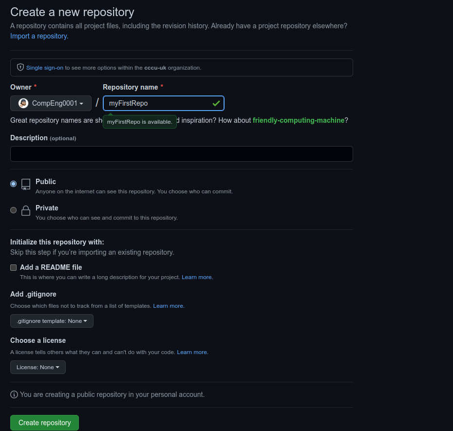
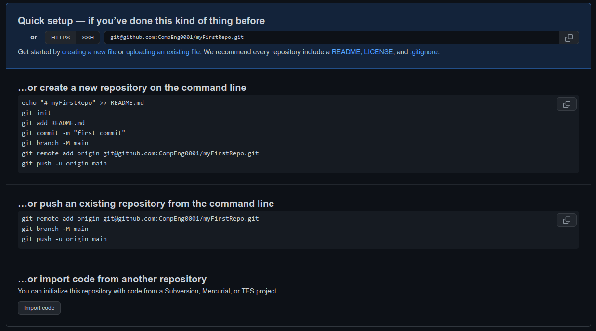
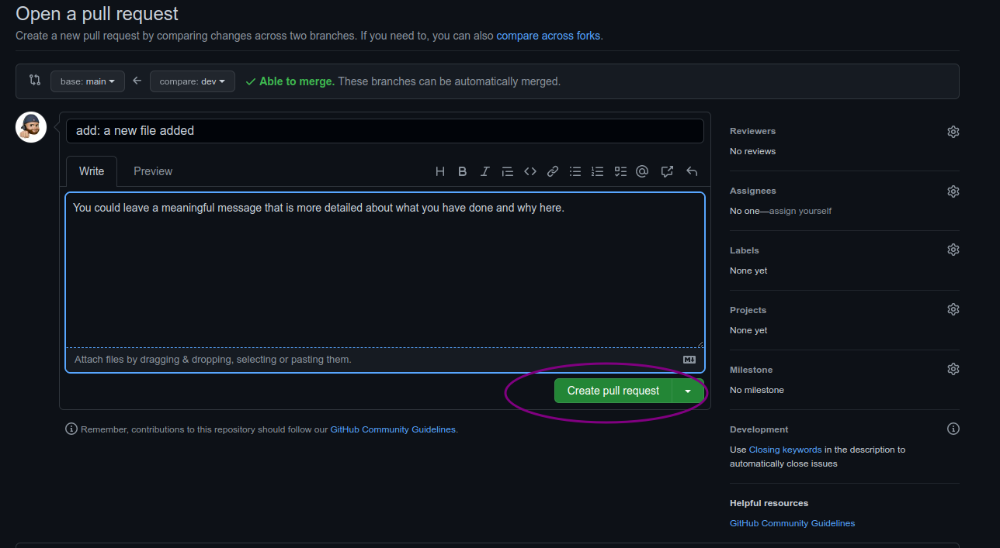
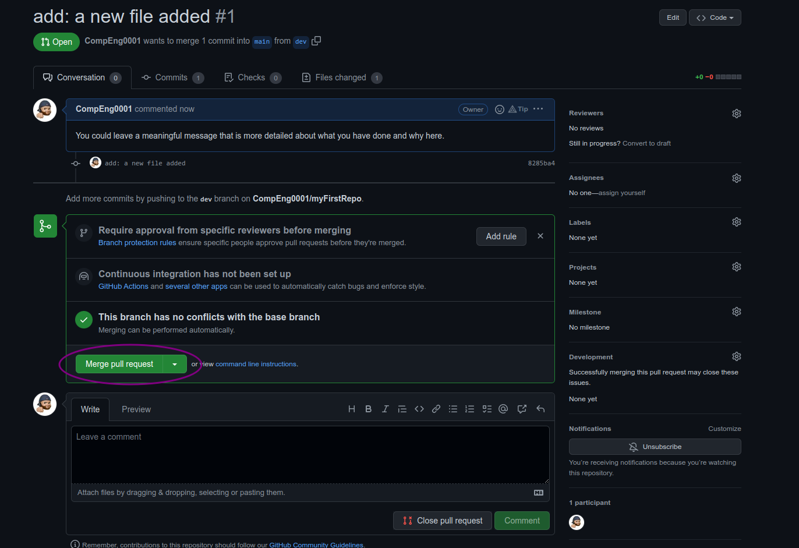
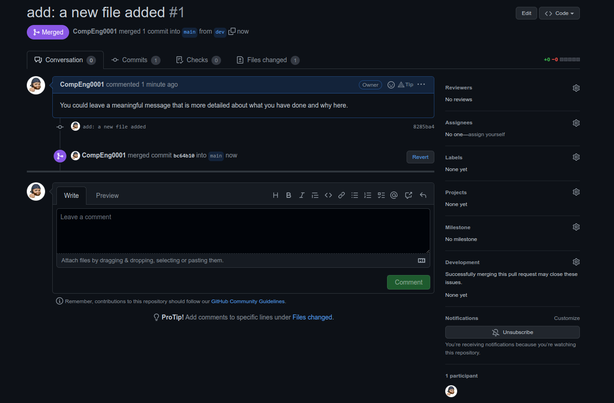
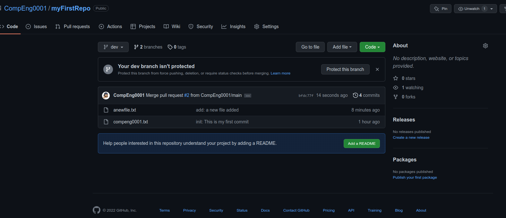

# My First Repository

## Introduction

The first two things you'll want to do are install git and create a free GitHub account.

Follow the instructions [here](https://git-scm.com/book/en/v2/Getting-Started-Installing-Git) to install git (if it's not already installed). Note that for this tutorial we will be using git on the command line only. While there are some great git GUIs (graphical user interfaces), It's easier to learn git using git-specific commands first and then to try out a git GUI once you're more comfortable with the command. 

>A note:
>> 95% of other online git resources and discussions will also be for the command-line interface. 

Once you've done that, create a GitHub account [here](https://github.com/join), you should use your university email account, but choose a different password.

>**Git and GitHub**
>
>> A quick aside: git and GitHub are **not** the same thing. Git is an open-source, version control tool created in 2005 by developers working on the Linux operating system; GitHub is a company founded in 2008 that makes tools which integrate with git. You do not need GitHub to use git, but you cannot use GitHub without using git. There are many other alternatives to GitHub, such as GitLab, BitBucket, and “host-your-own” solutions such as gogs and gittea. All of these are referred to in git-speak as “remotes”, and all are completely optional. You do not need to use a remote to use git, but it will make sharing your code with others easier.

## Step 1: Create a local git repository 
When creating a new project on your local machine using git, you'll first create a new repository (or often, 'repo', for short). 

To use git we'll be using the terminal. If you don't have much experience with the terminal and basic commands, check out this tutorial (If you don’t want/ need a short history lesson, skip to step three.)

To begin, open up a terminal and move to where you want to place the project on your local machine using the cd (change directory) command. For example, if you have a 'projects' folder on your desktop, you'd do something like:

```sh
❯ cd Documents/

~/Documents
❯ mkdir myfirstrepository

~/Documents
❯ cd myfirstrepository

~/Documents/myfirstrepository
```

>**Note:**
>> - Do not use a directory monitored by OneDrive, as there will be conflicts between git and OneDrive. 
>> - On University machines navigate to the `G` drive and use Documents or some other Directory 

To initialize a git repository in the root of the folder, run the `git init` command:

```sh
~/Documents/myfirstrepository
❯ git init
hint: Using 'master' as the name for the initial branch. This default branch name
hint: is subject to change. To configure the initial branch name to use in all
hint: of your new repositories, which will suppress this warning, call:
hint:
hint: 	git config --global init.defaultBranch <name>
hint:
hint: Names commonly chosen instead of 'master' are 'main', 'trunk' and
hint: 'development'. The just-created branch can be renamed via this command:
hint:
hint: 	git branch -m <name>
Initialized empty Git repository in /home/seb/Documents/myfirstrepository/.git/
```

Regardless of the output above, rename the current branch with:

```sh
myfirstrepository on master
❯ git branch -M main

myfirstrepository on main
❯
```

## Step 2: Add a new file to the repo
Go ahead and add a new file to the project, using any text editor you like or running a touch command. `touch newfile.txt` just creates and saves a blank file named `newfile.txt`. 

Once you've added or modified files in a folder containing a git repo, git will notice that  the file exists inside the repo. But, git won't track the file unless you explicitly tell it to. Git only saves/manages changes to files that it tracks, so we’ll need to send a command to confirm that yes, we want git to track our new file.

```sh

myfirstrepository on main
❯ touch compeng0001.txt

myfirstrepository on main
❯ ls
compeng0001.txt
```

After creating the new file, you can use the `git status` command to see which files git knows exist.

```sh
❯ git status
On branch main

No commits yet

Untracked files:
  (use "git add <file>..." to include in what will be committed)
	compeng0001.txt

nothing added to commit but untracked files present (use "git add" to track)
```

What this basically says is, "Hey, we noticed you created a new file called compeng0001.txt, but unless you use the `git add` command we aren't going to do anything with it."


> **An interlude: The staging environment, the commit, and you**
> 
>>One of the most confusing parts when you're first learning git is the concept of the staging environment and how it relates to a `commit`.
>>
>>A [commit](https://docs.github.com/en/free-pro-team@latest/github/getting-started-with-github/github-glossary#:~:text=the%20repository%20owner.-,commit,who%20made%20them%20and%20when.) is a record of what changes you have made since the last time you made a commit. Essentially, you make changes to your repo (for example, adding a file or modifying one) and then tell git to put those changes into a `commit`.
>>
>>Commits make up the essence of your project and allow you to jump to the state of a project at any other `commit`.
>>
>>So, how do you tell git which files to put into a `commit`? This is where the [staging environment](https://git-scm.com/book/en/v2/Git-Basics-Recording-Changes-to-the-Repository) or index come in. As seen in Step 2, when you make changes to your repo, git notices that a file has changed but won't do anything with it (like adding it in a commit).
>>
>>To add a file to a commit, you first need to add it to the staging environment. To do this, you can use the [`git add <filename]>`](http://git-scm.com/docs/git-add) command (see Step 3 below).
>>
>>Once you've used the git add command to add all the files you want to the staging environment, you can then tell git to package them into a commit using the [`git commit`](http://git-scm.com/docs/git-commit) command. 
>>
>>Note: The staging environment, also called 'staging', is the new preferred term for this, but you can also see it referred to as the 'index'.


## Step 3: Add a file to the staging environment

Add a file to the staging environment using the `git add` command. 

```sh
myfirstrepository on main
❯ git add compeng0001.txt
```

If you rerun the `git status` command, you'll see that git has added the file to the staging environment (notice the "Changes to be committed" line). 

```sh
❯ git status
On branch main

No commits yet

Changes to be committed:
  (use "git rm --cached <file>..." to unstage)
	new file:   compeng0001.txt
```

To reiterate, the file has **not** yet been added to a commit, but it's about to be.

However, first we need to make sure we have some creditentials for the commit to log who and when.

First set your username:

```sh
git config --global user.name "YourGitHubUserName"
```

Next set your email:

```sh
git config --global user.email "TheEmailYouUsedForGitHub"
```

## Step 4: Create a commit

It's time to create your first commit!

Run the command `git commit -m "Your message about the commit"`

```sh
myfirstrepository on main
❯ git commit -m "init: This is my first commit"
[main (root-commit) f2e1069] init: This is my first commit
 1 file changed, 0 insertions(+), 0 deletions(-)
 create mode 100644 compeng0001.txt
```

The message at the end of the commit should be something related to what the commit contains - maybe it's a new feature, maybe it's a bug fix, maybe it's just fixing a typo. Don't put a message like "asdfadsf" or "foobar". That makes the other people who see your commit sad. Very, very, sad. Commits live forever in a repository (technically you can delete them if you really, really need to but it’s messy), so if you leave a clear explanation of your changes it can be extremely helpful for future programmers (perhaps future you!) who are trying to figure out why some change was made years later.

## Step 5: Create a new branch

Now that you've made a new commit, let's try something a little more advanced.

Say you want to make a new feature but are worried about making changes to the main project while developing the feature. This is where [git branches](https://git-scm.com/book/en/v2/Git-Branching-Branches-in-a-Nutshell) come in. 

Branches allow you to move back and forth between 'states' of a project. Official git docs describe branches this way: ‘A branch in Git is simply a lightweight movable pointer to one of these commits.’ For instance, if you want to add a new page to your website you can create a new branch just for that page without affecting the main part of the project. Once you're done with the page, you can [`merge`](https://git-scm.com/book/en/v2/Git-Branching-Basic-Branching-and-Merging) your changes from your branch into the primary branch. When you create a new branch, Git keeps track of which commit your branch 'branched' off of, so it knows the history behind all the files. 

Let's say you are on the primary branch and want to create a new branch to develop your web page. Here's what you'll do: Run [`git checkout -b <my branch name>`](https://git-scm.com/docs/git-checkout). This command will automatically create a new branch and then 'check you out' on it, meaning git will move you to that branch, off of the primary branch.

After running the above command, you can use the [`git branch`](http://git-scm.com/docs/git-branch) command to confirm that your branch was created:

```sh
myfirstrepository on main
❯ git checkout -b dev
Switched to a new branch 'dev'
```

```sh 
myfirstrepository on mainmerge
❯ git branch
* dev
  main
```

The branch name with the asterisk next to it indicates which branch you're on at that given time. 


> **A note on branch names**
>
>>By default, every git repository’s first branch is named `master` (and is typically used as the primary branch in the project). As part of the tech industry’s general anti-racism work, some groups have begun to use alternate names for the default branch (we are using “primary” in this tutorial, for example). In other documentation and discussions, you may see “master”, or other terms, used to refer to the primary branch. Regardless of the name, just keep in mind that nearly every repository has a primary branch that can be thought of as the official version of the repository. If it’s a website, then the primary branch is the version that users see. If it’s an application, then the primary branch is the version that users download. This isn’t technically necessary (git doesn’t treat any branches differently from other branches), but it’s how git is traditionally used in a project.
>>
>>If you are curious about the decision to use different default branch names, GitHub has an explanation of their change here: [https://github.com/github/renaming](https://github.com/github/renaming)
>>
>>Now, if you switch back to the primary branch and make some more commits, your new branch won't see any of those changes until you [`merge`](http://git-scm.com/docs/git-merge) those changes onto your new branch.

## Step 6: Create a new repository on GitHub

If you only want to keep track of your code locally, you don't need to use GitHub. But if you want to work with a team, you can use GitHub to collaboratively modify the project's code.

To create a new repo on GitHub, log in and go to the GitHub home page. You can find the “New repository” option under the “+” sign next to your profile picture, in the top right corner of the navbar:

<div align=center>


</div>

After clicking the button, GitHub will ask you to name your repo and provide a brief description:

<div align=center>



</div>

You will see your new repo has been created with some useful instructions on creating and pushing a repo. 

<div align=center>



</div>

Go back to the terminal.

## Security and authentication

You need to create an ssh key to push and pull to your online storage/repo before we try to sync with the cloud. 

Follow these instructions in the command line.

```sh
myfirstrepository on  dev
❯ ssh-keygen -t ed25519 -C "YourGitEmail"
```

For every line requesting  user input just press the enter key and until the command has finished.

**Output:**

```sh
Generating public/private ed25519 key pair.
Enter file in which to save the key (/home/yourusername/.ssh/id_ed25519):
Created directory '/home/yourusername/.ssh'.
Enter passphrase (empty for no passphrase):
Enter same passphrase again:
Your identification has been saved in /home/yourusername/.ssh/id_ed25519
Your public key has been saved in /home/yourusername/.ssh/id_ed25519.pub
The key fingerprint is:
SHA256:opMi+Jtjau26rE8pbgULmR4gI4SHnkxFV0dZVz1HO2g YourGitEmail
The key's randomart image is:
+--[ED25519 256]--+
|oooo ....oo. ..oo|
|B.. .   ..  . ..+|
|B=.          E oo|
|+*          .   .|
|o +   . S        |
|.o o o .         |
|+ * +            |
|oBo+ .           |
|*OO+             |
+----[SHA256]-----+
```

Now you need to get your public key you have generated and add to GitHub.

```sh
myfirstrepository on  dev
❯ cat ~/.ssh/id_ed25519.pub
ssh-ed25519 AAAAC3NzaC1lZDI1NTE5AAAAIBJf5t9RcKdkZwlxS14EZn91hDQndAjMIDz+c92kFtfC YourGitEmail
```

The copy the output from `ssh-ed25519 ... YourGitEmail` and follow the screenshots below.

<div align=center>

1. 
2. 
3. 
4. 
</div>

Once completed, go back to the terminal and lets check for a connection:

```sh
❯ ssh git@github.com
```

```sh
The authenticity of host 'github.com (140.82.121.4)' can't be established.
ED25519 key fingerprint is SHA256:+DiY3wvvV6TuJJhbpZisF/zLDA0zPMSvHdkr4UvCOqU.
This key is not known by any other names
Are you sure you want to continue connecting (yes/no/[fingerprint])? yes
```

```sh
Warning: Permanently added 'github.com' (ED25519) to the list of known hosts.
PTY allocation request failed on channel 0
Hi CompEng0001! You've successfully authenticated, but GitHub does not provide shell access.
Connection to github.com closed.
```
>**Note:**
>
>> You only have do this once per machine.


Now that is done, we can actually push our work to the cloud. 

## Step 7: Push a branch to GitHub
Now we'll `push` the commit in your branch to your new GitHub repo. This allows other people to see the changes you've made. If they're approved by the repository's owner, the changes can then be merged into the primary branch.


First create a reference to the online repo.

```sh
myfirstrepository on dev
❯ git remote add origin git@github.com:CompEng0001/myFirstRepo.git
```

To push changes onto a new branch on GitHub, you'll want to run `git push origin yourbranchname`. GitHub will automatically create the branch for you on the remote repository:

```sh
myfirstrepository on dev
❯ git push origin dev
Enumerating objects: 3, done.
Counting objects: 100% (3/3), done.
Writing objects: 100% (3/3), 236 bytes | 236.00 KiB/s, done.
Total 3 (delta 0), reused 0 (delta 0), pack-reused 0
To github.com:CompEng0001/myFirstRepo.git
 * [new branch]      dev -> dev
```

Now go back to the main branch and lets make sure that is pushed to the cloud aswell.

```sh
myfirstrepository on dev
❯ git checkout main
Switched to branch 'main'

myfirstrepository on main
❯ git push
fatal: The current branch main has no upstream branch.
To push the current branch and set the remote as upstream, use

    git push --set-upstream origin main

```

...then:

```sh
myfirstrepository on main
❯ git push --set-upstream origin main
Total 0 (delta 0), reused 0 (delta 0), pack-reused 0
remote:
remote: Create a pull request for 'main' on GitHub by visiting:
remote:      https://github.com/CompEng0001/myFirstRepo/pull/new/main
remote:
To github.com:CompEng0001/myFirstRepo.git
 * [new branch]      main -> main
branch 'main' set up to track 'origin/main'.

```


You might be wondering what that "origin" word means in the command above. What happens is that when you clone a remote repository to your local machine, git creates an alias for you. In nearly all cases this alias is called "[origin](https://git-scm.com/book/en/v2/Git-Basics-Working-with-Remotes)." It's essentially shorthand for the remote repository's URL. So, to push your changes to the remote repository, you could've used either the command: `git push git@github.com:git/git.git yourbranchname `or `git push origin yourbranchname`

(If this is your first time using GitHub locally, it might prompt you to log in with your GitHub username and password.)

If you refresh the GitHub page, you'll see note saying a branch with your name has just been pushed into the repository. You can also click the 'branches' link to see your branch listed there.

Now lets make a change locally in the `dev` branch.

```sh 
myfirstrepository on main
❯ git checkout dev
Switched to branch 'dev'
```
```sh
myfirstrepository on  dev
❯ touch anewfile.txt
```
```sh
myfirstrepository on dev [?]
❯ git add anewfile.txt
```
```sh
myfirstrepository on dev [+]
❯ git commit -m "add: a new file added"
[dev 8285ba4] add: a new file added
 1 file changed, 0 insertions(+), 0 deletions(-)
 create mode 100644 anewfile.txt
```
```sh
myfirstrepository on dev
❯ git push
fatal: The current branch dev has no upstream branch.
To push the current branch and set the remote as upstream, use

    git push --set-upstream origin dev

```
```sh
myfirstrepository on dev
❯ git push --set-upstream origin dev
Enumerating objects: 3, done.
Counting objects: 100% (3/3), done.
Delta compression using up to 4 threads
Compressing objects: 100% (2/2), done.
Writing objects: 100% (2/2), 264 bytes | 264.00 KiB/s, done.
Total 2 (delta 0), reused 0 (delta 0), pack-reused 0
To github.com:CompEng0001/myFirstRepo.git
   f2e1069..8285ba4  dev -> dev
branch 'dev' set up to track 'origin/dev'.

```


## Step 8: Create a pull request (PR)

A pull request (or PR) is a way to alert a repo's owners that you want to make some changes to their code. It allows them to review the code and make sure it looks good before putting your changes on the primary branch.

This is what the PR page looks like before you've submitted it:

<div align=center>


</div>

And this is what it looks like once you've submitted the PR request:

 
You might see a big green button at the bottom that says 'Merge pull request'. Clicking this means you'll merge your changes into the primary branch..



Sometimes you'll be a co-owner or the sole owner of a repo, in which case you may not need to create a PR to merge your changes. However, it's still a good idea to make one so you can keep a more complete history of your updates and to make sure you always create a new branch when making changes.

## Step 9: Merge a PR
Go ahead and click the green 'Merge pull request' button. This will merge your changes into the primary branch.





When you're done, I recommend deleting your branch (too many branches can become messy), so hit that grey 'Delete branch' button as well.

You can double check that your commits were merged by clicking on the 'Commits' link on the first page of your new repo.




You can also see the hash code of the commit on the right hand side. A hash code is a unique identifier for that specific commit. It's useful for referring to specific commits and when undoing changes (use the `git revert <hash code number>` command to backtrack).

Now back to the terminal.

## Step 10: Get changes on GitHub back to your computer

Right now, the repo on GitHub looks a little different than what you have on your local machine. For example, the commit you made in your branch and merged into the primary branch doesn't exist in the primary branch on your local machine.

In order to get the most recent changes that you or others have merged on GitHub, use the `git pull origin master`command(when working on the primary branch). In most cases, this can be shortened to `git pull`.

```sh
❯ git checkout main
Switched to branch 'main'
Your branch is up to date with 'origin/main'.
```
```sh
myfirstrepository on  main
❯ git pull
remote: Enumerating objects: 2, done.
remote: Counting objects: 100% (2/2), done.
remote: Compressing objects: 100% (2/2), done.
Unpacking objects: 100% (2/2), 1.20 KiB | 1.21 MiB/s, done.
remote: Total 2 (delta 0), reused 0 (delta 0), pack-reused 0
From github.com:CompEng0001/myFirstRepo
   f2e1069..bc64b10  main       -> origin/main
   8285ba4..bfdc77f  dev        -> origin/dev
Updating f2e1069..bc64b10
Fast-forward
 anewfile.txt | 0
 1 file changed, 0 insertions(+), 0 deletions(-)
 create mode 100644 anewfile.txt
```

This shows you all the files that have changed and how they've changed.

Now we can use the [`git log`](http://git-scm.com/docs/git-log) command again to see all new commits.

(You may need to switch branches back to the primary branch. You can do that using the git checkout master command.)

```sh
myfirstrepository on main
❯ git log
commit bc64b101b966bcee5f8b87c451b674450638d981 (HEAD -> main, origin/main)
Merge: f2e1069 8285ba4
Author: CompEng0001 <40290417+CompEng0001@users.noreply.github.com>
Date:   Sat Nov 5 12:46:32 2022 +0000

    Merge pull request #1 from CompEng0001/dev

    add: a new file added

commit 8285ba429f3ab757e8549416b33dde454e563e09 (dev)
Author: CompEng0001 <sb1501@canterbury.ac.uk>
Date:   Sat Nov 5 12:39:27 2022 +0000

    add: a new file added

commit f2e1069137b6bc0115e119b3aae83c35cc1d0358
Author: CompEng0001 <sb1501@canterbury.ac.uk>
Date:   Sat Nov 5 11:52:16 2022 +0000

    init: This is my first commit
```

Well done, you have completed the first git workflow!
